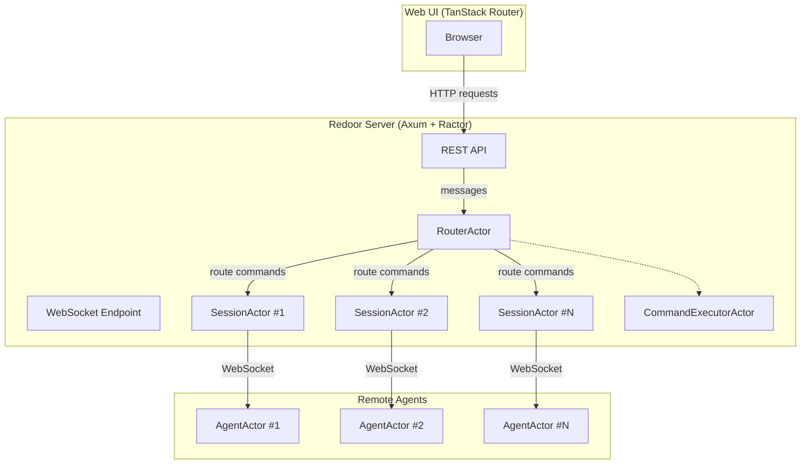
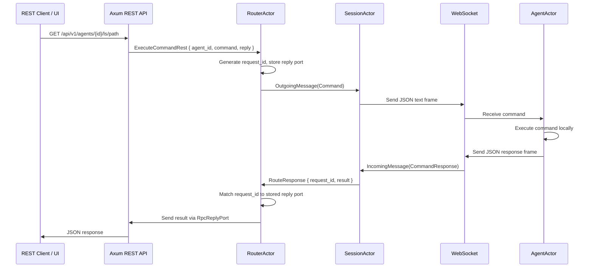
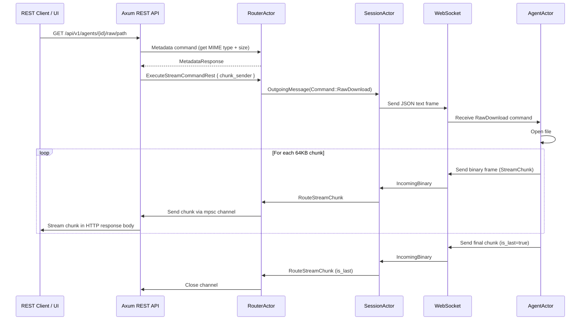
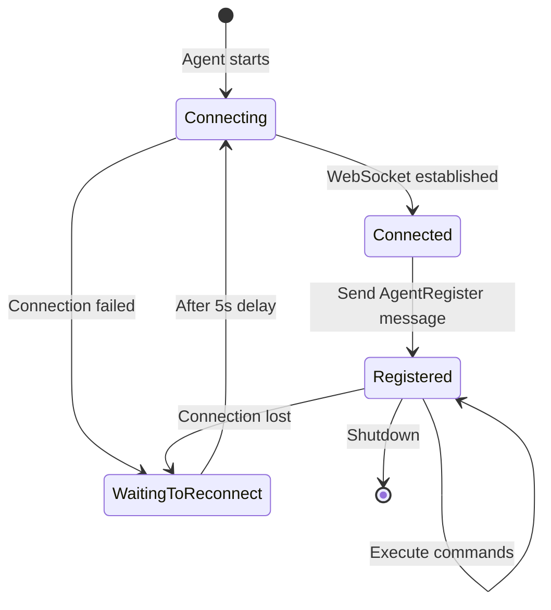

# Redoor

A remote agent management system built with Rust, Tokio, Axum, and the Ractor actor framework. Redoor enables remote command execution and file operations on distributed agents through a central server, with a web UI for management.

## Overview

Redoor consists of three main components:

- **Server** (`redoor`) — An HTTP + WebSocket server that acts as the central hub
- **Agent** (`redoor-agent`) — A lightweight process that connects to the server and executes commands locally
- **UI** — A TanStack Router web application for managing agents and browsing remote file systems

## Architecture



## Actor System

The server uses the [Ractor](https://github.com/slawlor/ractor) actor framework to manage concurrent connections and command routing.

### Actors

| Actor                           | Cardinality                  | Responsibility                                                                                                        |
| ------------------------------- | ---------------------------- | --------------------------------------------------------------------------------------------------------------------- |
| **RouterActor**                 | Singleton                    | Central hub. Maintains agent registry, routes commands to agents, correlates request/response pairs.                  |
| **SessionActor**                | One per WebSocket connection | Bridges a single WebSocket connection to the actor system. Deserializes inbound frames, serializes outbound messages. |
| **CommandExecutorActor**        | Singleton                    | Executes commands locally on the server side.                                                                         |
| **AgentActor** _(agent binary)_ | One per agent process        | Manages the agent's WebSocket connection, executes commands locally, and streams results back.                        |

### Message Flow: REST Command Execution



### Message Flow: Streaming File Download

Large file downloads use a custom binary streaming protocol to avoid loading entire files into memory.



### Agent Lifecycle



## Server Components

### REST API

| Method | Endpoint                            | Description                                         |
| ------ | ----------------------------------- | --------------------------------------------------- |
| `GET`  | `/ws`                               | WebSocket upgrade endpoint for agents               |
| `GET`  | `/api/v1/agents`                    | List all connected agents                           |
| `GET`  | `/api/v1/agents/{agent}`            | Get agent details (PID, OS, hostname, uptime, etc.) |
| `GET`  | `/api/v1/agents/{agent}/ls/{path}`  | List directory or get file info on the agent        |
| `GET`  | `/api/v1/agents/{agent}/cat/{path}` | Read file contents as text from the agent           |
| `GET`  | `/api/v1/agents/{agent}/raw/{path}` | Stream raw file bytes from the agent                |
| `POST` | `/api/v1/agents/{agent}/echo`       | Echo a message through the agent (for testing)      |

### Commands

Commands are sent to agents as JSON messages over WebSocket and executed locally on the agent machine:

| Command           | Description                                                                |
| ----------------- | -------------------------------------------------------------------------- |
| `Ls`              | List directory entries or get file metadata (owner, group, uid, gid, size) |
| `Cat`             | Read a file as UTF-8 text                                                  |
| `RawDownload`     | Stream file contents as binary chunks                                      |
| `Metadata`        | Get file MIME type and size                                                |
| `Echo`            | Echo a message back (with optional random delay for testing)               |
| `AgentInfo`       | Get agent runtime info (PID, CWD, load averages)                           |
| `GetAgentDetails` | Full agent details including OS, arch, hostname, username                  |

### Binary Streaming Protocol

Streaming transfers use a custom binary protocol over WebSocket binary frames:

```
┌──────────────┬───────────────┬──────────────┬─────────┬──────────┬──────────┬──────────┐
│ Magic (4B)   │ Request ID    │ Chunk Index  │ Is Last │ Is Error │ Reserved │ Data     │
│ 0x52415844   │ (8B LE u64)   │ (8B LE u64)  │ (1B)    │ (1B)     │ (1B)     │ (var)    │
└──────────────┴───────────────┴──────────────┴─────────┴──────────┴──────────┴──────────┘
                              Total header: 23 bytes
                              Chunk size: 64KB max data per chunk
```

## Project Structure

```
redoor/
├── src/
│   ├── main.rs                  # Server entry point (Axum routes + actor bootstrap)
│   ├── lib.rs                   # Library root (re-exports)
│   ├── types.rs                 # WebSocket message types (AgentRegister, Command, etc.)
│   ├── commands.rs              # Command definitions, result types, and CommandHandler
│   ├── streaming.rs             # Binary streaming protocol (StreamChunk)
│   ├── logging.rs               # Logging utilities
│   ├── agent_types.rs           # Agent-related type definitions
│   ├── bin/
│   │   └── redoor-agent.rs      # Agent binary (AgentActor)
│   └── actors/
│       ├── mod.rs
│       ├── router.rs            # RouterActor — central message hub
│       ├── session.rs           # SessionActor — per-connection WebSocket bridge
│       └── command_executor.rs  # CommandExecutorActor — local command execution
├── bindings/                    # Auto-generated TypeScript interfaces (ts-rs)
├── ui/                          # Web UI (TanStack Router + Tailwind)
│   ├── src/
│   │   ├── api-client.ts        # Typed REST API client
│   │   └── routes/              # File-based routes
│   └── e2e/                     # Playwright tests
└── scripts/
    └── generate-ts-bindings     # Script to regenerate TypeScript bindings
```

## TypeScript Bindings

Rust structs annotated with `#[ts(export)]` via [ts-rs](https://github.com/Aleph-Alpha/ts-rs) automatically generate TypeScript interfaces in the `bindings/` directory. The UI imports these types to ensure type safety between the Rust server and the TypeScript frontend.

Generated bindings include: `AgentListResponse`, `AgentDetailsResponse`, `AgentInfoResponse`, `LsDirectoryResponse`, `LsFileResponse`, `LsEntry`, `CatResponse`, `EchoRequest`, `EchoResponse`, `ErrorResponse`, `MetadataResponse`.

## Getting Started

### Configuration

| Environment Variable | Default | Description                      |
| -------------------- | ------- | -------------------------------- |
| `REDOOR_PORT`        | `3000`  | Port for the server to listen on |

### Running the Server

```sh
cargo run --bin redoor

# Override the listen port
cargo run --bin redoor -- --port 4000
```

### Running an Agent

```sh
# Connect to a server with a custom name
cargo run --bin redoor-agent -- ws://127.0.0.1:3000/ws --name my-agent
```

### Running the UI

```sh
cd ui
pnpm install
pnpm run dev
```

### Building & Testing

```sh
./scripts/build-and-test
```

### Regenerating TypeScript Bindings

```sh
./scripts/generate-ts-bindings
```

## Tech Stack

| Component                | Technology                                                                                |
| ------------------------ | ----------------------------------------------------------------------------------------- |
| Runtime                  | [Tokio](https://tokio.rs/)                                                                |
| HTTP / WebSocket Server  | [Axum](https://github.com/tokio-rs/axum)                                                  |
| Actor Framework          | [Ractor](https://github.com/slawlor/ractor)                                               |
| WebSocket Client (Agent) | [tokio-tungstenite](https://github.com/snapview/tokio-tungstenite)                        |
| Serialization            | [serde](https://serde.rs/) + serde_json                                                   |
| TypeScript Codegen       | [ts-rs](https://github.com/Aleph-Alpha/ts-rs)                                             |
| Frontend                 | [TanStack Router](https://tanstack.com/router) + [Tailwind CSS](https://tailwindcss.com/) |
| E2E Tests                | [Playwright](https://playwright.dev/)                                                     |
