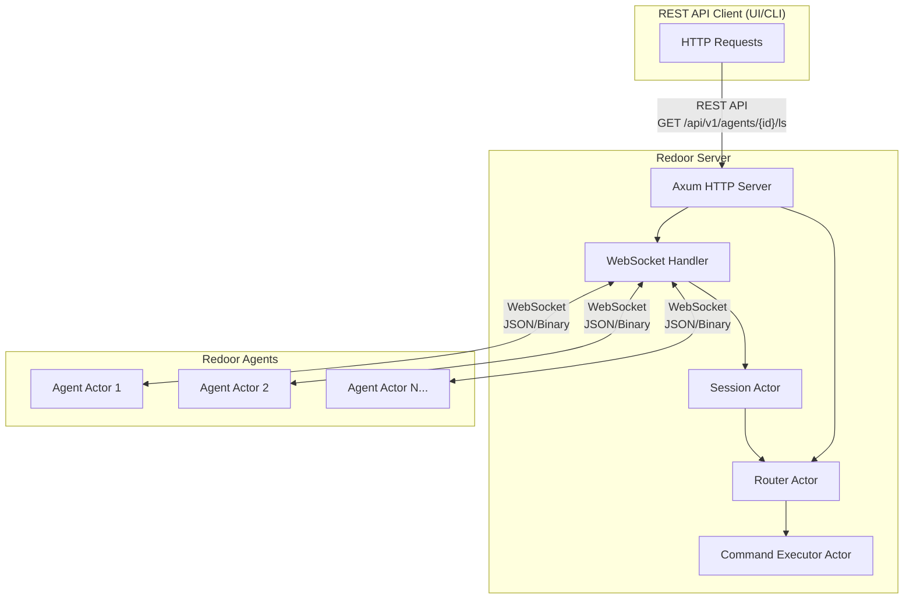
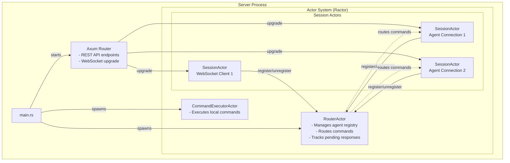
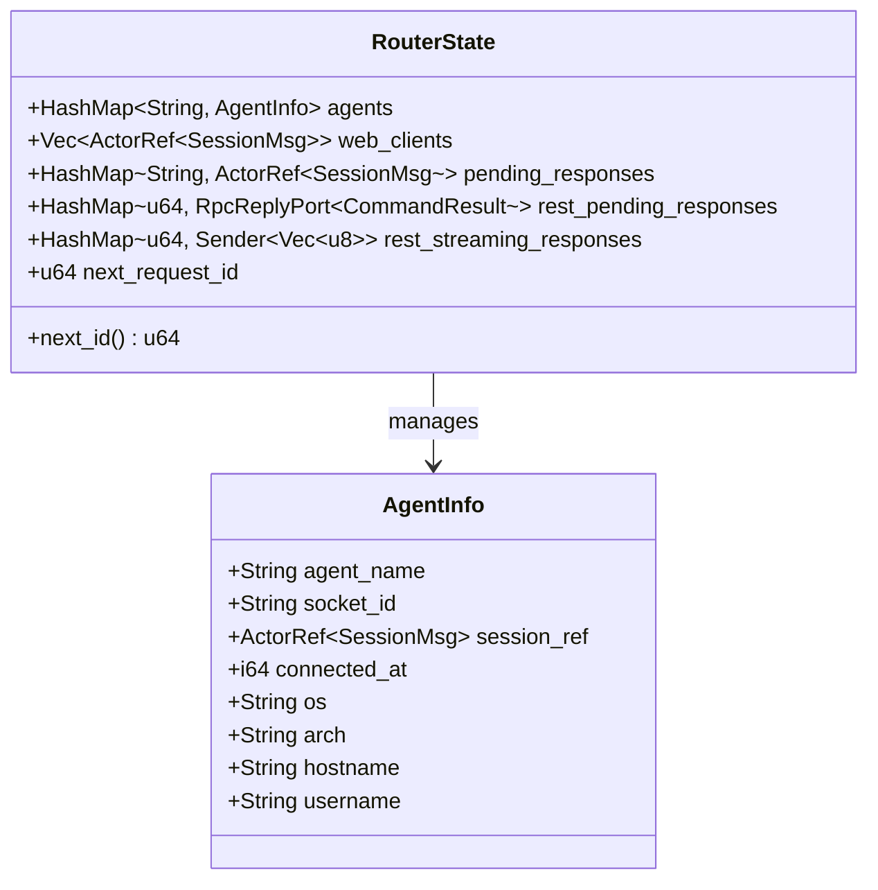
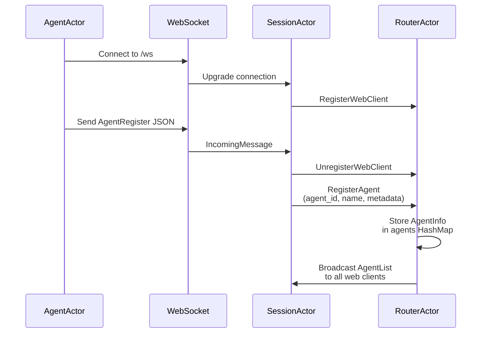
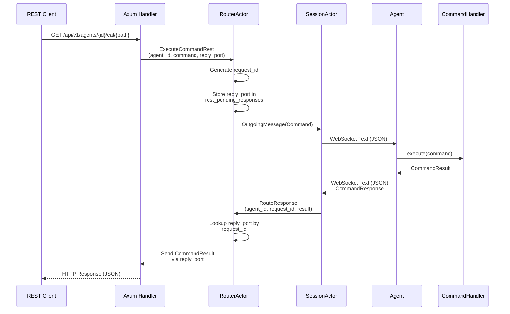
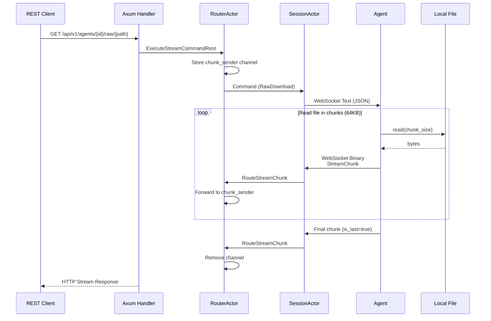
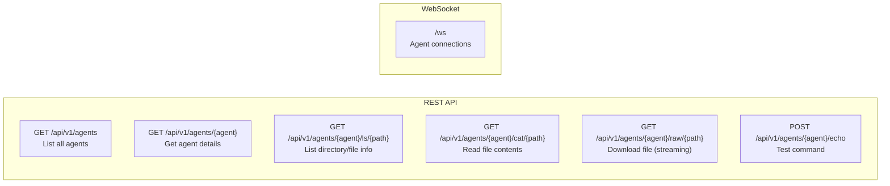
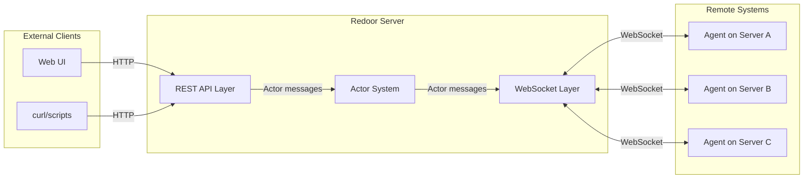

# Redoor

Redoor is a distributed command execution system consisting of a central server and multiple agents that connect via WebSockets. The server exposes a REST API that allows clients to execute commands on remote agents.

## Overview



## Architecture

The server is built on Tokio with Axum for HTTP/WebSocket handling and Ractor for the actor system.

### Actor Hierarchy



### Router Actor State



## Agent Architecture

Agents are standalone binaries that connect to the server and execute commands locally.

```mermaid
flowchart TB
    subgraph AgentProcess["Agent Process (redoor-agent)"]
        Main[main.rs]
        
        subgraph AgentActor["AgentActor"]
            State[AgentState
- agent_id
- agent_name
- server_url
- ws_tx
- active_request_id]
            
            Handler[Message Handler
- Connect
- WebSocketMessage
- ConnectionLost
- Reconnect]
        end
        
        CmdHandler[CommandHandler
- ls, cat, echo
- raw_download
- agent_info]
        
        WS[WebSocket Connection
(tokio-tungstenite)]
    end

    Main -->|spawns| AgentActor
    AgentActor -->|connects to| WS
    AgentActor -->|executes| CmdHandler
    
    WS <-->|WebSocket| Server[(Redoor Server)]
```

## Communication Flows

### 1. Agent Registration



### 2. REST API Command Execution



### 3. File Streaming (Binary Protocol)



### 4. Binary Protocol Format


## Message Types

### JSON Message Protocol

```mermaid
classDiagram
    class Message {
        <<enum>>
        AgentRegister
        AgentUnregister
        AgentList
        Command
        CommandResponse
        Error
    }
    
    class Command {
        <<enum>>
        Ls { path }
        Cat { path }
        RawDownload { path }
        Metadata { path }
        Echo { request }
        AgentInfo
        GetAgentDetails
    }
    
    class CommandResult {
        <<enum>>
        LsDirectory
        LsFile
        Cat
        RawDownload
        Metadata
        Echo
        AgentInfo
        GetAgentDetails
        Error
    }
    
    Message --> Command : contains
    Message --> CommandResult : contains
```

### Router Message Types

```mermaid
flowchart LR
    subgraph RouterMsg["RouterMsg"]
        direction TB
        RegisterAgent["RegisterAgent<br/>(agent_id, name, socket_id, ...)"]
        UnregisterAgent["UnregisterAgent<br/>(agent_id)"]
        RegisterWebClient["RegisterWebClient<br/>(session_ref)"]
        UnregisterWebClient["UnregisterWebClient<br/>(session_ref)"]
        RouteCommand["RouteCommand<br/>(agent_id, command, originating_client)"]
        RouteResponse["RouteResponse<br/>(agent_id, request_id, result)"]
        GetAgentList["GetAgentList<br/>(reply)"]
        ExecuteCommandRest["ExecuteCommandRest<br/>(agent_id, command, reply)"]
        ExecuteStreamCommandRest["ExecuteStreamCommandRest<br/>(agent_id, command, reply, chunk_sender)"]
        RouteStreamChunk["RouteStreamChunk<br/>(agent_id, request_id, chunk_index, is_last, is_error, data)"]
    end
```



## REST API Endpoints



## Data Flow Summary


