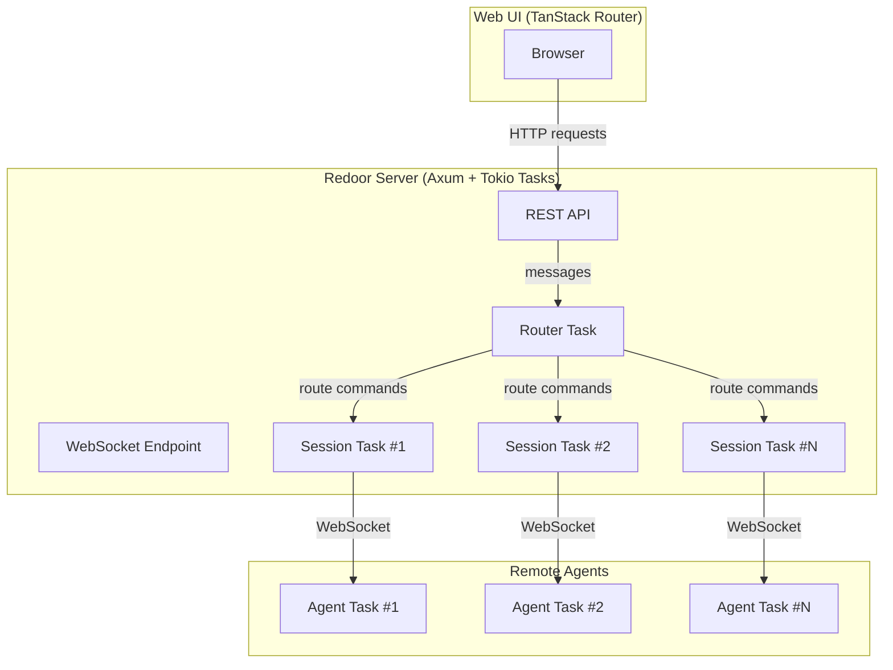
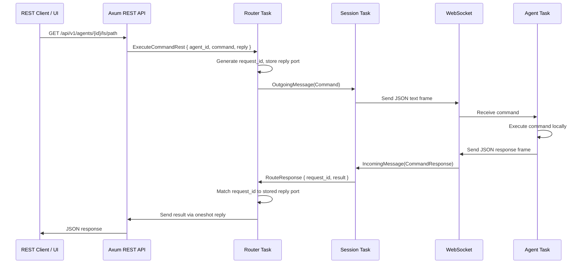
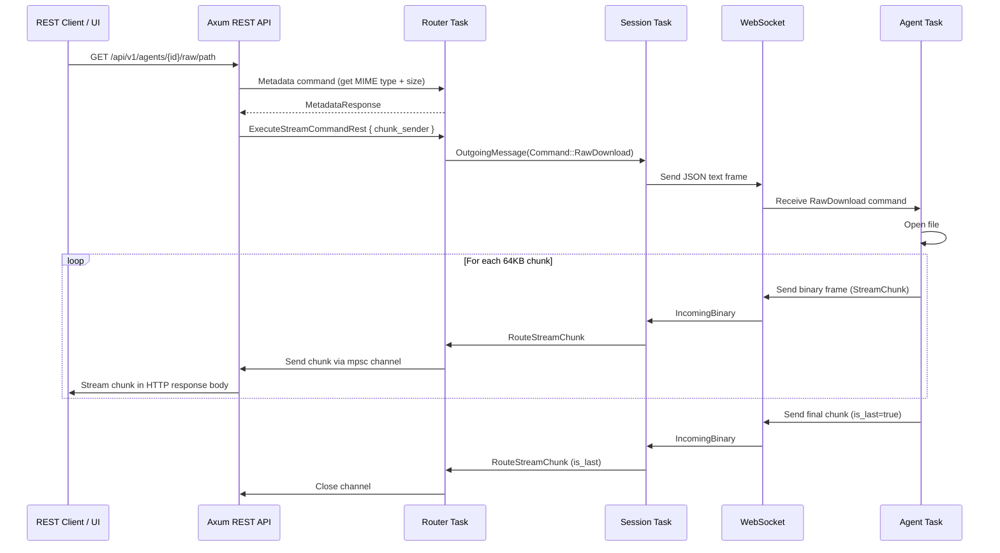
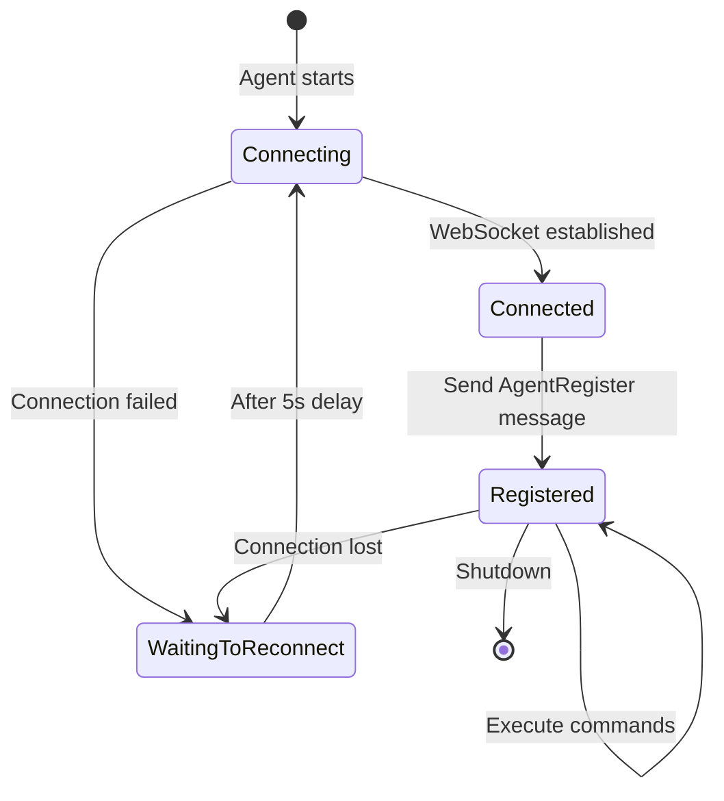

# Redoor

A remote agent management system built with Rust, Tokio, and Axum. Redoor enables remote command execution and file operations on distributed agents through a central server, with a web UI for management.

## Install

Download binary to `~/.local/bin/redoor`

```sh
bash -c "$(curl -fsSL https://raw.githubusercontent.com/esamattis/redoor/main/install.sh)"
```

## Overview

Redoor consists of three main components:

- **Server** (`redoor`) — An HTTP + WebSocket server that acts as the central hub
- **Agent** (`redoor-agent`) — A lightweight process that connects to the server and executes commands locally
- **UI** — A TanStack Router web application for managing agents and browsing remote file systems

## Architecture


```mermaid
graph TB
    subgraph UI["Web UI (TanStack Router)"]
        Browser["Browser"]
    end

    subgraph Server["Redoor Server (Axum + Tokio Tasks)"]
        REST["REST API"]
        WS["WebSocket Endpoint"]
        Router["Router Task"]
        Session1["Session Task #1"]
        Session2["Session Task #2"]
        SessionN["Session Task #N"]
    end

    subgraph Agents["Remote Agents"]
        Agent1["Agent Task #1"]
        Agent2["Agent Task #2"]
        AgentN["Agent Task #N"]
    end

    Browser -- "HTTP requests" --> REST
    REST -- "messages" --> Router
    Router -- "route commands" --> Session1
    Router -- "route commands" --> Session2
    Router -- "route commands" --> SessionN
    Session1 -- "WebSocket" --> Agent1
    Session2 -- "WebSocket" --> Agent2
    SessionN -- "WebSocket" --> AgentN
```

## Task Architecture

The server uses dedicated Tokio tasks and message passing to manage concurrent connections and command routing.

### Runtime Tasks

| Actor                           | Cardinality                  | Responsibility                                                                                                  |
| ------------------------------- | ---------------------------- | --------------------------------------------------------------------------------------------------------------- |
| **Router Task**                 | Singleton                    | Central hub. Maintains agent registry, routes commands to agents, correlates request/response pairs.            |
| **Session Task**                | One per WebSocket connection | Bridges a single WebSocket connection to the router. Deserializes inbound frames, serializes outbound messages. |
| **Agent Task** _(agent binary)_ | One per agent process        | Manages the agent's WebSocket connection, executes commands locally, and streams results back.                  |

### Message Flow: REST Command Execution


```mermaid
sequenceDiagram
    participant Client as REST Client / UI
    participant API as Axum REST API
    participant Router as Router Task
    participant Session as Session Task
    participant WS as WebSocket
    participant Agent as Agent Task

    Client->>API: GET /api/v1/agents/{id}/ls/path
    API->>Router: ExecuteCommandRest { agent_id, command, reply }
    Router->>Router: Generate request_id, store reply port
    Router->>Session: OutgoingMessage(Command)
    Session->>WS: Send JSON text frame
    WS->>Agent: Receive command
    Agent->>Agent: Execute command locally
    Agent->>WS: Send JSON response frame
    WS->>Session: IncomingMessage(CommandResponse)
    Session->>Router: RouteResponse { request_id, result }
    Router->>Router: Match request_id to stored reply port
    Router->>API: Send result via oneshot reply
    API->>Client: JSON response
```

### Message Flow: Streaming File Download

Large file downloads use a custom binary streaming protocol to avoid loading entire files into memory.


```mermaid
sequenceDiagram
    participant Client as REST Client / UI
    participant API as Axum REST API
    participant Router as Router Task
    participant Session as Session Task
    participant WS as WebSocket
    participant Agent as Agent Task

    Client->>API: GET /api/v1/agents/{id}/raw/path
    API->>Router: Metadata command (get MIME type + size)
    Router-->>API: MetadataResponse
    API->>Router: ExecuteStreamCommandRest { chunk_sender }
    Router->>Session: OutgoingMessage(Command::RawDownload)
    Session->>WS: Send JSON text frame
    WS->>Agent: Receive RawDownload command
    Agent->>Agent: Open file

    loop For each 64KB chunk
        Agent->>WS: Send binary frame (StreamChunk)
        WS->>Session: IncomingBinary
        Session->>Router: RouteStreamChunk
        Router->>API: Send chunk via mpsc channel
        API->>Client: Stream chunk in HTTP response body
    end

    Agent->>WS: Send final chunk (is_last=true)
    WS->>Session: IncomingBinary
    Session->>Router: RouteStreamChunk (is_last)
    Router->>API: Close channel
```

### Agent Lifecycle


```mermaid
stateDiagram-v2
    [*] --> Connecting: Agent starts
    Connecting --> Connected: WebSocket established
    Connecting --> WaitingToReconnect: Connection failed
    Connected --> Registered: Send AgentRegister message
    Registered --> Registered: Execute commands
    Registered --> WaitingToReconnect: Connection lost
    WaitingToReconnect --> Connecting: After 5s delay
    Registered --> [*]: Shutdown
```

## Server Components

### REST API

| Method | Endpoint                            | Description                                         |
| ------ | ----------------------------------- | --------------------------------------------------- |
| `GET`  | `/ws`                               | WebSocket upgrade endpoint for agents               |
| `GET`  | `/api/v1/agents`                    | List all connected agents                           |
| `GET`  | `/api/v1/agents/{agent}`            | Get agent details (PID, OS, hostname, uptime, etc.) |
| `GET`  | `/api/v1/agents/{agent}/ls/{path}`  | List directory or get file info on the agent        |
| `GET`  | `/api/v1/agents/{agent}/cat/{path}` | Read file contents as text from the agent           |
| `GET`  | `/api/v1/agents/{agent}/raw/{path}` | Stream raw file bytes from the agent                |
| `POST` | `/api/v1/agents/{agent}/echo`       | Echo a message through the agent (for testing)      |

### Commands

Commands are sent to agents as JSON messages over WebSocket and executed locally on the agent machine:

| Command           | Description                                                                |
| ----------------- | -------------------------------------------------------------------------- |
| `Ls`              | List directory entries or get file metadata (owner, group, uid, gid, size) |
| `Cat`             | Read a file as UTF-8 text                                                  |
| `RawDownload`     | Stream file contents as binary chunks                                      |
| `Metadata`        | Get file MIME type and size                                                |
| `Echo`            | Echo a message back (with optional random delay for testing)               |
| `AgentInfo`       | Get agent runtime info (PID, CWD, load averages)                           |
| `GetAgentDetails` | Full agent details including OS, arch, hostname, username                  |

### Binary Streaming Protocol

Streaming transfers use a custom binary protocol over WebSocket binary frames:

```
┌──────────────┬───────────────┬──────────────┬─────────┬──────────┬──────────┬──────────┐
│ Magic (4B)   │ Request ID    │ Chunk Index  │ Is Last │ Is Error │ Reserved │ Data     │
│ 0x52415844   │ (8B LE u64)   │ (8B LE u64)  │ (1B)    │ (1B)     │ (1B)     │ (var)    │
└──────────────┴───────────────┴──────────────┴─────────┴──────────┴──────────┴──────────┘
                              Total header: 23 bytes
                              Chunk size: 64KB max data per chunk
```

## Project Structure

```
redoor/
├── src/
│   ├── main.rs                  # Server entry point (Axum routes + router bootstrap)
│   ├── lib.rs                   # Library root (re-exports)
│   ├── types.rs                 # WebSocket message types (AgentRegister, Command, etc.)
│   ├── commands.rs              # Command definitions, result types, and CommandHandler
│   ├── streaming.rs             # Binary streaming protocol (StreamChunk)
│   ├── logging.rs               # Logging utilities
│   ├── agent_types.rs           # Agent-related type definitions
│   ├── bin/
│   │   └── redoor-agent.rs      # Agent binary runtime
│   └── actors/
│       ├── mod.rs
│       ├── router.rs            # Router task — central message hub
│       └── session.rs           # Session task — per-connection WebSocket bridge
├── bindings/                    # Auto-generated TypeScript interfaces (ts-rs)
├── ui/                          # Web UI (TanStack Router + Tailwind)
│   ├── src/
│   │   ├── api-client.ts        # Typed REST API client
│   │   └── routes/              # File-based routes
│   └── e2e/                     # Playwright tests
└── scripts/
    └── generate-ts-bindings     # Script to regenerate TypeScript bindings
```

## TypeScript Bindings

Rust structs annotated with `#[ts(export)]` via [ts-rs](https://github.com/Aleph-Alpha/ts-rs) automatically generate TypeScript interfaces in the `bindings/` directory. The UI imports these types to ensure type safety between the Rust server and the TypeScript frontend.

Generated bindings include: `AgentListResponse`, `AgentDetailsResponse`, `AgentInfoResponse`, `LsDirectoryResponse`, `LsFileResponse`, `LsEntry`, `CatResponse`, `EchoRequest`, `EchoResponse`, `ErrorResponse`, `MetadataResponse`.

## Getting Started

### Configuration

The server requires a TOML configuration file. Pass one with `--config`:

```sh
redoor server --config config.toml
```

When `--config` is omitted, Redoor loads `~/.config/redoor/config.toml`. If it
does not exist, Redoor creates it with a random `agent_token` and commented
examples of every available option. On Linux the starter config omits
`username`/`password` so browser login uses the process owner's system account
via PAM; on other platforms it embeds a generated username/password pair.
Store the printed secrets securely. The required `[server]` table always needs
`agent_token`. The optional `[[agents]]` array registers SSH-backed or local
managed agents; SSH and local entries can be mixed in the same file. Configured
agents start lazily when their tab/status page is opened or when **Start** is
used from the **Agents** management view. That view retains stopped and
previously disconnected agents, shows connection recency and startup issues,
and offers shutdown controls only for TOML-managed entries. Externally launched
agents remain observation-only.

#### Server settings

Server settings can come from CLI flags, the config file, environment variables,
or built-in defaults. Precedence is CLI flag, config file, environment variable,
then default. Only the port has an environment-variable fallback.

| Config key           | Type    | CLI flag | Env var       | Default   | Description                                                                 |
| -------------------- | ------- | -------- | ------------- | --------- | --------------------------------------------------------------------------- |
| `server.port`        | integer | `--port` | `REDOOR_PORT` | `3000`    | HTTP and WebSocket listener port. Must fit in an unsigned 16-bit integer.   |
| `server.bind`        | string  | `--bind` | —             | `0.0.0.0` | Address on which the server listens. Use `127.0.0.1` for local-only access. |
| `server.log`         | string  | `--log`  | —             | stderr    | Server log file path.                                                       |
| `server.username`    | string  | —        | —             | optional* | Username accepted by the browser login form.                                |
| `server.password`    | string  | —        | —             | optional* | Password accepted by the browser login form. Keep the config file private.  |
| `server.agent_token` | string  | —        | —             | required  | Shared secret agents must present when registering.                         |

\* `username` and `password` must both be set or both omitted. On Linux, omitting
both authenticates browser logins against the process owner's system account via
PAM. On other platforms both values are required.

The `[server]` table and a non-empty `agent_token` are required. Unknown keys are
rejected so misspelled settings do not silently fall back to defaults. Successful
logins use an HTTP-only cookie backed by one JSON file per session in
`~/.local/share/redoor/sessions/`; logout removes that file.

#### SSH-backed agents

An agent entry is SSH-backed unless it contains `local = true`. The server
connects to the target through SSH, ensures the configured Redoor binary is
available on the remote host, starts the remote agent, and creates a reverse
port forward back to the server.

| Key          | Type    | Required | Default                                   | Description                                                                      |
| ------------ | ------- | -------- | ----------------------------------------- | -------------------------------------------------------------------------------- |
| `target`     | string  | Yes      | —                                         | SSH host or `user@host` target.                                                  |
| `local`      | boolean | No       | `false`                                   | Leave unset or set to `false` for an SSH-backed agent.                           |
| `username`   | string  | No       | SSH configuration or the user in `target` | SSH login username, equivalent to `ssh -l`.                                      |
| `ssh_port`   | integer | No       | `22`                                      | SSH server port, equivalent to `ssh -p`. Must fit in an unsigned 16-bit integer. |
| `name`       | string  | No       | Host portion of `target`                  | Name under which the agent registers with the server.                            |
| `remote_bin` | string  | No       | `~/.local/redoor/<version>/redoor`        | Redoor binary path on the remote host.                                           |
| `dir`        | string  | No       | Remote shell's current directory          | Default directory opened when the UI agent tab is clicked.                       |
| `log`        | string  | No       | Inherit server stdio                      | Local file to which the SSH process's stdout and stderr are appended.            |

#### Local agents

Set `local = true` to make a lazily launched managed agent use the same machine
and Redoor executable as the server. Local entries must not contain `target`,
`username`, `ssh_port`, or `remote_bin`.

| Key     | Type    | Required | Default                                    | Description                                                       |
| ------- | ------- | -------- | ------------------------------------------ | ----------------------------------------------------------------- |
| `local` | boolean | Yes      | —                                          | Must be `true` to select a local agent.                           |
| `name`  | string  | No       | System hostname, or `local` if unavailable | Name under which the agent registers with the server.             |
| `dir`   | string  | No       | Server process's current directory         | Default directory opened when the UI agent tab is clicked.        |
| `log`   | string  | No       | Inherit server stdio                       | File to which the agent process's stdout and stderr are appended. |

Agent names must be unique. The server rejects duplicate names during startup.
Agent log paths are opened on the server machine for both SSH-backed and local
agents; they are not paths on the remote SSH host.

The default directory is immutable startup metadata, not a filesystem boundary.
Agents expose the host filesystem subject to OS permissions, and all filesystem
REST paths and UI browser routes use complete absolute paths. Relative REST
paths are rejected rather than resolved against the default directory.

#### Example

```toml
[server]
port = 3000
bind = "0.0.0.0"
log = "log/server.log"
username = "admin"
password = "replace-with-a-long-private-password"

# Minimal SSH-backed agent. Its name defaults to "example.com" and SSH uses
# the username from the target, port 22, and the versioned remote binary path.
[[agents]]
target = "user@example.com"

# SSH-backed agent with every optional setting overridden.
[[agents]]
target = "prod.example.com"
username = "deploy"
ssh_port = 2222
name = "production"
remote_bin = "/usr/local/bin/redoor"
dir = "/srv/application"
log = "log/production.log"

# Agent running on the server machine.
[[agents]]
local = true
name = "local"
dir = "/srv/local-application"
log = "log/local.log"
```

### Running the Server

```sh
# Uses ~/.config/redoor/config.toml
cargo run --bin redoor -- server --port 4000

# Uses an explicit config file (server settings + optional auto-started agents)
cargo run --bin redoor -- server --config config.toml
```

### Running an Agent

```sh
# Connect to a server with a custom name and UI default directory
cargo run --bin redoor -- agent ws://127.0.0.1:3000/ws --name my-agent --dir /srv/application
```

### Running the UI

```sh
cd ui
pnpm install
pnpm run dev
```

### Building & Testing

```sh
./scripts/build-and-test
```

### Regenerating TypeScript Bindings

```sh
./scripts/generate-ts-bindings
```

## Tech Stack

| Component                | Technology                                                                                |
| ------------------------ | ----------------------------------------------------------------------------------------- |
| Runtime                  | [Tokio](https://tokio.rs/)                                                                |
| HTTP / WebSocket Server  | [Axum](https://github.com/tokio-rs/axum)                                                  |
| Concurrency Model        | Tokio tasks + channels                                                                    |
| WebSocket Client (Agent) | [tokio-tungstenite](https://github.com/snapview/tokio-tungstenite)                        |
| Serialization            | [serde](https://serde.rs/) + serde_json                                                   |
| TypeScript Codegen       | [ts-rs](https://github.com/Aleph-Alpha/ts-rs)                                             |
| Frontend                 | [TanStack Router](https://tanstack.com/router) + [Tailwind CSS](https://tailwindcss.com/) |
| E2E Tests                | [Playwright](https://playwright.dev/)                                                     |
