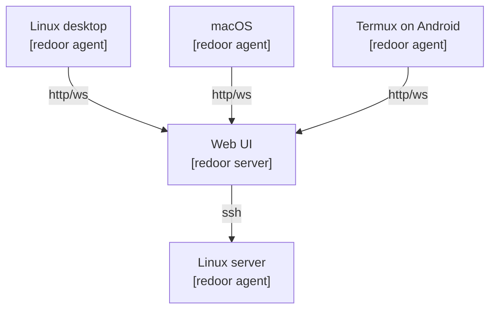

# redoor

Manual computer management using server-agent architecture. Agents run on computers and connect back to the central redoor server or the server starts the agents manually using SSH. The server provides a web UI with file browser and remote shell for each agent. The file browser features search, file editing, download/upload and streaming file and directory copying between agents.



```mermaid
graph TD
    Server["Web UI
[redoor server]"]
    Server -->|ssh| LinuxServer["Linux server
[redoor agent]"]
    LinuxDesktop["Linux desktop
[redoor agent]"] -->|http/ws| Server
    macOS["macOS
[redoor agent]"] -->|http/ws| Server
    Termux["Termux on Android
[redoor agent]"] -->|http/ws| Server
```

## Install

For Linux, macOS, and Termux on Android.

```bash
bash -c "$(curl -fsSL https://raw.githubusercontent.com/esamattis/redoor/refs/heads/main/install.sh)"
```

This just puts the `redoor` binary in `~/.local/bin` (or `/usr/local/bin` as root). The binary is the same for the server and the agent. Or just manually download static pre-build binary from [releases](https://github.com/esamattis/redoor/releases).

To configure background services do

```bash
redoor server systemd setup
redoor agent systemd setup
```

or for macOS

```bash
redoor server launchd setup
redoor agent launchd setup
```

See `redoor --help` for more

## Configuration

Server and agent can share the same TOML file. Put it in `~/.config/redoor/config.toml` (or `/etc/redoor/config.toml` as root).

`redoor server` example 

```toml
# Shared secret between the server and the agent
agent_token = "secret"

## Server configuration
[server]
# Web UI login. On Linux, omit both to use PAM (system user).
# username = "admin"
# password = "long-private-password"

# port = 3000
# bind = "0.0.0.0" # default 127.0.0.1
# cookie_secure = false # set true behind HTTPS
# log = "log/server.log"

## Managed agents, connects via ssh tunnels, auto installs agent binary
[[agents]]
target = "user@example.com"
# username = "deploy"
# ssh_port = 22
# name = "prod-server"
# dir = "/srv/app"
# log = "/var/log/redoor/agent.log"

[[agents]]
# local agent, that runs on the same computer as the server
local = true
name = "local"
dir = "/home/me/projects"
log = "~/.local/share/redoor/log/local.log"
```

`redoor agent` example 

```toml
# Shared secret between the server and the agent
agent_token = "secret"

[agent]
ws_address = "ws://127.0.0.1:3000/ws"
name = "macbook"
# dir = "/home/me/projects"
# log = "log/agent.log"
```
