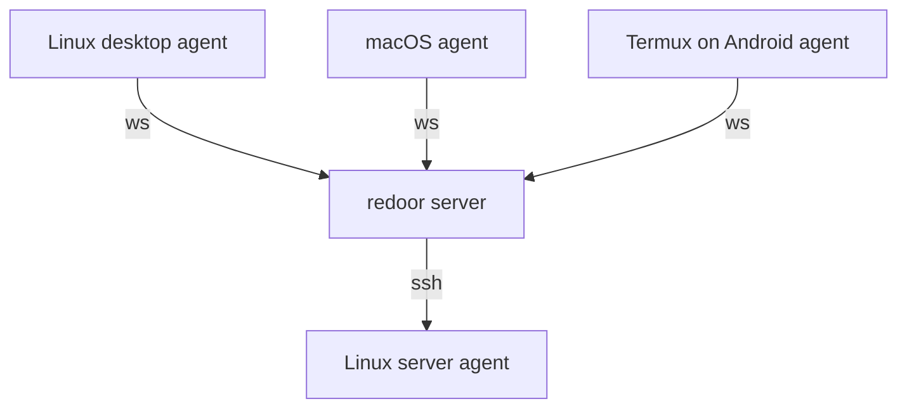

# redoor

Manual computer management using server-agent architecture. Agents run on computers and connect back to the central redoor server or the server starts the agents manually using SSH. The server provides a web UI with file browser and remote shell for each agent.

Support Linux, macOS, and Termux on Android.


```mermaid
graph TD
    Server[redoor server]
    Server -->|ssh| LinuxServer[Linux server agent]
    LinuxDesktop[Linux desktop agent] -->|ws| Server
    macOS[macOS agent] -->|ws| Server
    Termux[Termux on Android agent] -->|ws| Server
```

## Install

```bash
bash -c "$(curl -fsSL https://raw.githubusercontent.com/esamattis/redoor/refs/heads/main/install.sh)"
```

This just puts the `redoor` binary in `~/.local/bin` (or `/usr/local/bin` as root).

To configure background services do

```bash
redoor server systemd setup
redoor agent systemd setup
```

or for macOS

```bash
redoor server launchd setup
redoor agent launchd setup
```

## Configuration

Server and agent use the same TOML file. Put it in `~/.config/redoor/config.toml` (or `/etc/redoor/config.toml` as root).

```toml
# Top-level: shared by server and agent (required)
agent_token = "replace-me"

## `redoor server`
[server]
# Optional browser login. On Linux, omit both to use PAM
# (process owner's system username/password).
# username = "admin"
# password = "long-private-password"

# port = 3000                 # also --port / REDOOR_PORT
# bind = "0.0.0.0"            # also --bind; default 127.0.0.1
# cookie_secure = false       # set true behind HTTPS
# log = "log/server.log"      # also --log

## `redoor agent`
[agent]
ws_address = "ws://127.0.0.1:3000/ws"   # also positional CLI / REDOOR_AGENT_WS
name = "local"                          # also --name / REDOOR_AGENT_NAME
# dir = "/home/me/projects"             # also -d/--dir / REDOOR_AGENT_DIR
# log = "log/agent.log"                 # also --log / REDOOR_AGENT_LOG

## Server-managed agents, that connect directly to the computer via SSH
[[agents]]
target = "user@example.com"
# username = "deploy"
# ssh_port = 22
# name = "prod"
# remote_bin = "${XDG_DATA_HOME:-$HOME/.local/share}/<app-name>/binaries/<version>/redoor"
# dir = "/srv/app"
# log = "log/prod.log"

[[agents]]
# local agent, that runs on the same computer as the server
local = true
name = "local"
dir = "/home/me/projects"
log = "~/.local/share/redoor/log/local.log"

```
