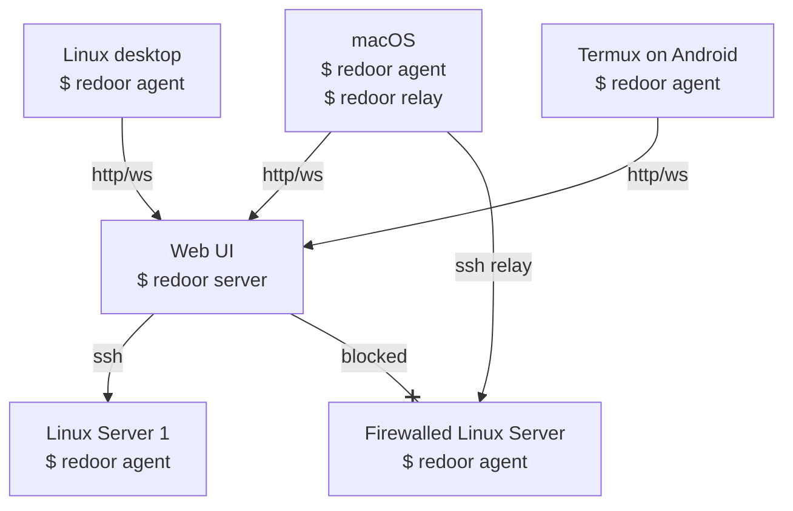

# redoor

Manual computer management using server-agent architecture.

Agents connect directly to the server via HTTP/WebSocket, or the server can provision and spawn agents using SSH. When direct connection is not possible in either direction, agents can connect via a relay agent that can reach both the server and the agent.

The server provides an unified Web UI for the agents with file browser and remote shell. The file browser features search, file editing, download/upload and streaming file and directory copying between agents.



```mermaid
graph TD
    Server["Web UI\n$ redoor server"]
    Server -->|ssh| LinuxServer["Linux Server 1\n$ redoor agent"]
    LinuxDesktop["Linux desktop\n$ redoor agent"] -->|http/ws| Server
    macOS["macOS\n$ redoor agent\n$ redoor relay"] -->|http/ws| Server
    macOS -->|"ssh relay"| Server2["Firewalled Linux Server\n$ redoor agent"]
    Server --x|blocked| Server2
    Termux["Termux on Android\n$ redoor agent"] -->|http/ws| Server
```

## Install

For Linux, macOS, and Termux on Android.

```bash
bash -c "$(curl -fsSL https://raw.githubusercontent.com/esamattis/redoor/refs/heads/main/install.sh)"
```

This just puts the `redoor` binary in `~/.local/bin` (or `/usr/local/bin` as root). The binary is the same for the server and the agent. Or just manually download static pre-build binary from [releases](https://github.com/esamattis/redoor/releases).

Start with

```
$HOME/.local/bin/redoor server
```

and see `$HOME/.local/bin/redoor --help`

## Configuration

Server and agent can share the same TOML file. Put it in `~/.config/redoor/config.toml` (or `/etc/redoor/config.toml` as root).

Full reference for every option: [docs/config.md](docs/config.md).

### Server

```toml
# Shared secret between the server and the agent
agent_token = "secret"

[server]
# Web UI login. On Linux, omit both to use PAM (system user).
# username = "admin"
# password = "long-private-password"

# port = 3000
# bind = "0.0.0.0" # default 127.0.0.1
# cookie_secure = false # set true behind HTTPS

## Automatically spawn agents via SSH
[[agents]]
target = "user@example.com"
name = "Linux Server"

[[agents]]
# local agent that runs on the same computer as the server
local = true
name = "local"
```

Run it

```bash
# Start immediately
redoor server

# or setup to run at startup if on linux
redoor server systemd setup
```

### Agent

```toml
# Shared secret between the server and the agent
agent_token = "secret"

[agent]
server = "http://127.0.0.1:3000"
name = "macbook"
```

Run it

```bash
# Start immediately
redoor agent

# or setup to run at startup if on linux
redoor agent systemd setup
```

## SSH relay

Add a named relay to `config.toml`:

```toml
agent_token = "secret"

[[relays]]
id = "production"
target = "user@host"
server = "http://redoor.internal:3000"
```

```bash
redoor agent relay start production --daemon
```

See [SSH relays](docs/relays.md) for lifecycle commands and configuration.
