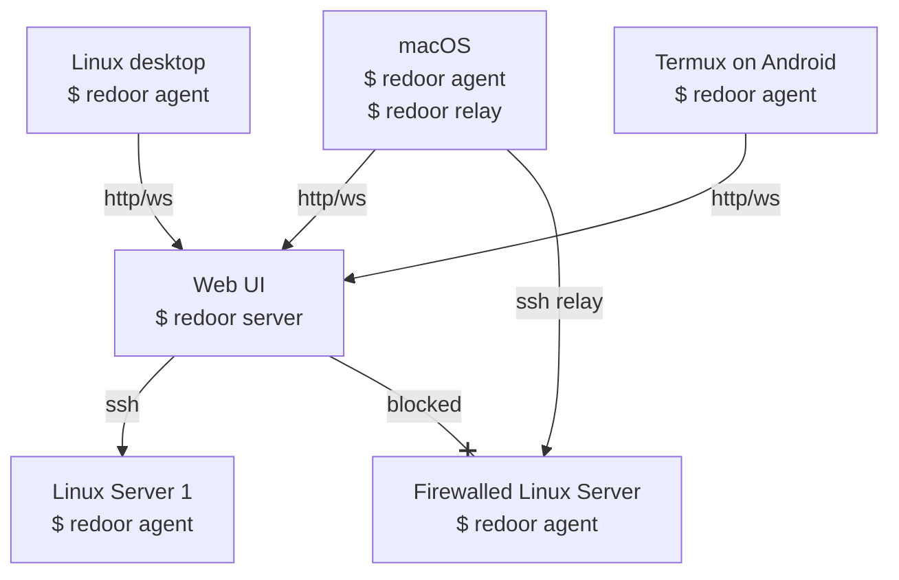

# redoor

Manual computer management using server-agent architecture. Agents run on computers and connect back to the central redoor server or the server starts the agents manually using SSH. The server provides a web UI with file browser and remote shell for each agent. The file browser features search, file editing, download/upload and streaming file and directory copying between agents.



```mermaid
graph TD
    Server["Web UI\n$ redoor server"]
    Server -->|ssh| LinuxServer["Linux Server 1\n$ redoor agent"]
    LinuxDesktop["Linux desktop\n$ redoor agent"] -->|http/ws| Server
    macOS["macOS\n$ redoor agent\n$ redoor relay"] -->|http/ws| Server
    macOS -->|"ssh relay"| Server2["Firewalled Linux Server\n$ redoor agent"]
    Server --x|blocked| Server2
    Termux["Termux on Android\n$ redoor agent"] -->|http/ws| Server
```

## Install

For Linux, macOS, and Termux on Android.

```bash
bash -c "$(curl -fsSL https://raw.githubusercontent.com/esamattis/redoor/refs/heads/main/install.sh)"
```

This just puts the `redoor` binary in `~/.local/bin` (or `/usr/local/bin` as root). The binary is the same for the server and the agent. Or just manually download static pre-build binary from [releases](https://github.com/esamattis/redoor/releases).

To configure background services do

```bash
redoor server systemd setup
redoor agent systemd setup
```

or for macOS

```bash
redoor server launchd setup
redoor agent launchd setup
```

See `redoor --help` for more

## SSH relay

Use `redoor agent relay` when the SSH target cannot reach the redoor server directly, but the machine running the command can reach both. The command provisions the agent when needed, opens a reverse SSH tunnel from a random port on the target, and exits when SSH exits. It does not supervise or restart the agent after successful startup.

`--server` is an `http(s)://` or `ws(s)://` URL reached from the machine running `redoor agent relay`, not from the SSH target. Path is optional and always forced to `/ws`:

```bash
REDOOR_AGENT_TOKEN=secret redoor agent relay --server http://redoor.internal.example:3000 user@linux-server
```

Use `https://` or `wss://` when TLS terminates at the routed endpoint. The agent connects through the random tunnel port while retaining the route hostname for TLS SNI and WebSocket HTTP authority. Normal certificate verification remains enabled:

```bash
REDOOR_AGENT_TOKEN=secret redoor agent relay --server https://redoor.example.com user@linux-server
```

For a self-signed, privately issued, expired, or hostname-mismatched certificate, `--insecure` disables TLS certificate verification and prints a warning. Use it only when the routed endpoint cannot provide a trusted certificate:

```bash
REDOOR_AGENT_TOKEN=secret redoor agent relay --server https://redoor.internal.example --insecure user@linux-server
```

Daemonize the local relay (PID/log under `~/.local/share/redoor/` as `relay.pid` / `relay.log`) the same way as agent/server:

```bash
REDOOR_AGENT_TOKEN=secret redoor agent relay --daemon --server http://redoor.internal.example:3000 user@linux-server
redoor agent relay status
redoor agent relay logs
redoor agent relay stop
```

## Configuration

Server and agent can share the same TOML file. Put it in `~/.config/redoor/config.toml` (or `/etc/redoor/config.toml` as root).

`redoor server` example 

```toml
# Shared secret between the server and the agent
agent_token = "secret"

## Server configuration
[server]
# Web UI login. On Linux, omit both to use PAM (system user).
# username = "admin"
# password = "long-private-password"

# port = 3000
# bind = "0.0.0.0" # default 127.0.0.1
# cookie_secure = false # set true behind HTTPS
# log = "log/server.log"

## Managed agents, connects via ssh tunnels, auto installs agent binary
[[agents]]
target = "user@example.com"
# username = "deploy"
# ssh_port = 22
# name = "prod-server"
# dir = "/srv/app"
# log = "/var/log/redoor/agent.log"

[[agents]]
# local agent, that runs on the same computer as the server
local = true
name = "local"
dir = "/home/me/projects"
log = "~/.local/share/redoor/log/local.log"
```

`redoor agent` example 

```toml
# Shared secret between the server and the agent
agent_token = "secret"

[agent]
server = "http://127.0.0.1:3000"
name = "macbook"
# dir = "/home/me/projects"
# log = "log/agent.log"
```
