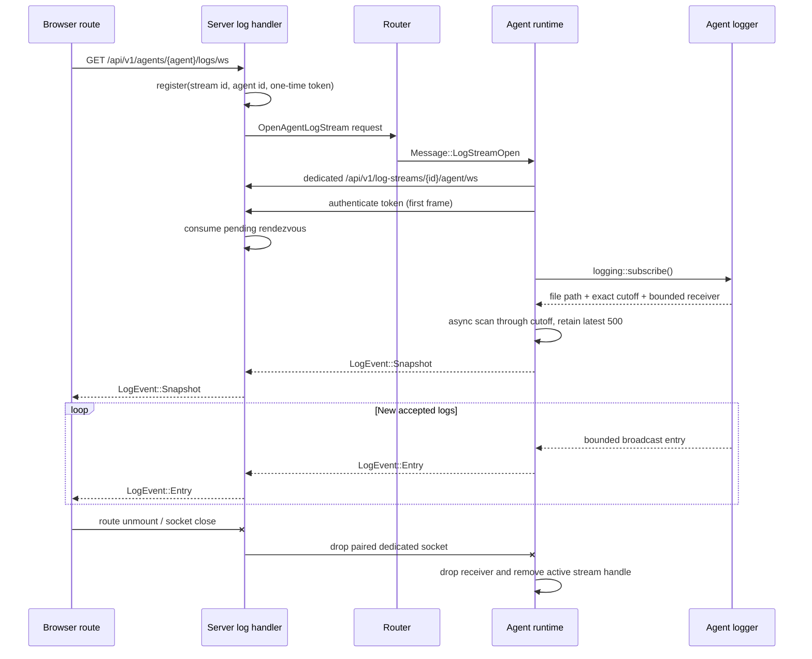

# Agent logs implementation plan

## Goal

Generalize the existing authenticated server-log viewer so browser users can open `/agents/<agent>/logs`, receive the selected agent's latest log history, and continue receiving that agent's logs live.

The implementation will use a **dedicated, short-lived agent log WebSocket** paired to the browser through the server, following the existing terminal rendezvous design. The agent's main `/ws` connection is used only to bootstrap the dedicated socket. Historical scanning and live log traffic never travel through the router mailbox or the main agent control socket, so file transfers and ordinary commands remain responsive while logs are viewed.

The completed feature must:

- preserve the existing `/logs` server-log route and behavior;
- add `/agents/$agentId/logs` and `/api/v1/agents/{agent}/logs/ws`;
- send a bounded, chronological snapshot followed by live entries;
- retain at most 500 entries in the browser and in each history scan;
- reconnect with a fresh snapshot after transient failure while the route remains mounted;
- immediately stop the dedicated agent subscription and release server rendezvous/relay resources when the browser route unmounts or its WebSocket disconnects;
- clean up pending and active log sessions when the authoritative agent control connection is lost;
- expose links to each connected agent's logs from `/logs` and a `View logs` action from `/agents/<agent>`;
- keep all disk access async and bounded in memory;
- add deterministic tests that poll state/log output rather than sleeping.

## Chosen architecture

### Why use a dedicated data-plane WebSocket

Do not send every live log entry as `Message` traffic on the agent's existing `/ws` connection. That connection currently carries registration, one-shot command responses, terminal setup, and transfer control (`src/types.rs:199-284`, `src/actors/session.rs:53-79`). Routing log entries through it would either:

- use the server session's unbounded text lane (`src/actors/session.rs:65-70`, `src/actors/session.rs:287-303`) and permit unbounded memory growth; or
- put continuous log messages into the bounded router mailbox (`src/actors/router/mod.rs:28-80`) and delay unrelated control work.

Instead, mirror the terminal flow in `src/server/terminals.rs:49-96` and `src/terminal_registry.rs:41-134`:

1. The authenticated browser opens `/api/v1/agents/{agent}/logs/ws`.
2. The server creates a random `LogStreamId` and one-time token, then registers a bounded pending rendezvous.
3. The server sends `Message::LogStreamOpen` over the authoritative agent control socket.
4. The agent starts a tracked task and opens `/api/v1/log-streams/{log_stream_id}/agent/ws`.
5. The agent authenticates the first frame with the one-time token.
6. The server consumes the rendezvous and directly relays validated `LogEvent` text frames from the dedicated agent socket to the browser.
7. Closing either paired socket drops the opposite relay branch. The agent observes its dedicated socket closing and drops its logger broadcast receiver immediately.

This creates end-to-end backpressure without intermediate unbounded queues: the agent awaits dedicated socket writes, the server awaits browser socket writes, and the logger's existing bounded broadcast channel (`src/logging.rs:12`, `src/logging.rs:65-73`) detects lag rather than growing memory.

### Resolved protocol behavior

1. **Snapshot/live ordering:** call `logging::subscribe()` before scanning history. It serializes subscription creation with logger writes and returns an exact file cutoff plus a live broadcast receiver (`src/logging.rs:50-73`, `src/logging.rs:183-197`, `src/logging.rs:219-228`). Read only through that cutoff, send `snapshot` first, then drain live records. This avoids gaps and duplicates.
2. **History limit:** reuse the current 500-entry behavior from `src/server/logs.rs:19-45`. Scan asynchronously from the beginning through the stable cutoff while retaining only a `VecDeque` of the latest 500 complete newline-delimited entries. Do not use `read_to_string` or read the entire file into memory.
3. **Agent without an active `--log` file:** send `snapshot { entries: [], file_logging_enabled: false }`, then continue with live in-process entries. This includes agents whose stdout/stderr is redirected externally by a managed local/SSH launcher rather than configured through the agent logger. The page explains that persistent history is unavailable while live entries remain available. Do not make the remote agent read a server-local redirected file.
4. **History I/O failure:** send a typed generic `error` event and close. Log the detailed path/I/O error only in the agent process; do not expose paths or raw OS errors to the browser.
5. **Slow browser:** no per-browser unbounded queue is allowed. If the logger broadcast receiver reports `Lagged`, attempt to send `LogEvent::Lagged { skipped }`, then end the dedicated agent socket. The mounted UI reconnects after one second and replaces its entries with a new snapshot.
6. **Disconnect during setup:** while waiting for the agent socket, the server concurrently reads the browser socket. A close/error/EOF removes the pending rendezvous immediately. If the agent attaches after the browser has left, handoff fails and the dedicated agent socket is dropped.
7. **Disconnect after pairing:** the server relays in two independent directions with `tokio::select!`. Browser close/error/EOF ends the relay and drops the agent socket. The agent selects between outbound forwarding and inbound disconnect detection, then drops `LogSubscription.receiver` and removes its active-session handle.
8. **Agent control disconnect:** the agent runtime cancels all tracked dedicated log tasks when its main connection is lost or the runtime stops. The server router removes that agent's unpaired log rendezvous entries alongside terminal pending entries. A paired dedicated socket closes when the agent task is canceled.
9. **Reconnect:** each browser reconnect creates a new stream ID, token, dedicated agent socket, logger subscription, and snapshot. IDs/tokens are never reused.
10. **Security:** the browser endpoint remains covered by session authentication. The agent endpoint is public only at the HTTP middleware layer, exactly like the terminal agent endpoint, and authenticates a random one-time token in its first WebSocket text frame. Never put the token in the URL or logs. Enforce same-origin browser handshakes by extracting the terminal helper into shared server WebSocket code rather than duplicating it.
11. **No REST API:** this feature adds WebSocket endpoints and exported WebSocket payloads, not a REST endpoint. No REST response struct is needed. `LogEvent` is still `#[ts(export)]` because the UI consumes it.

## Protocol sketch

### Shared event and dedicated socket protocol

Add `src/log_protocol.rs` with comments on every public type and method:

```rust
use serde::{Deserialize, Serialize};
use ts_rs::TS;
use uuid::Uuid;

/// Identifies one browser-owned agent log tunnel until both sockets are released.
#[derive(Debug, Clone, PartialEq, Eq, Hash, Serialize, Deserialize)]
pub struct LogStreamId(pub Uuid);

impl LogStreamId {
    /// Creates an unpredictable rendezvous id so pending stream URLs cannot be enumerated.
    pub fn new() -> Self {
        Self(Uuid::new_v4())
    }
}

/// Carries bounded history and live updates for either server or agent logs.
#[derive(Debug, Clone, Serialize, Deserialize, TS)]
#[ts(export)]
#[serde(tag = "type", rename_all = "snake_case")]
#[ts(rename_all = "snake_case")]
pub enum LogEvent {
    /// Replaces the browser rolling window at an exact history/live boundary.
    Snapshot {
        entries: Vec<String>,
        file_logging_enabled: bool,
    },
    /// Appends one logger record accepted after the snapshot boundary.
    Entry { entry: String },
    /// Forces a fresh snapshot because bounded live delivery dropped records.
    Lagged {
        #[ts(type = "number")]
        skipped: u64,
    },
    /// Reports a safe setup or history failure without exposing filesystem details.
    Error { message: String },
}

/// First dedicated-agent frame proving possession of the bootstrap secret.
#[derive(Debug, Clone, Serialize, Deserialize)]
#[serde(tag = "type", rename_all = "snake_case")]
pub enum LogAgentHandshake {
    Authenticate { token: String },
}
```

Move/rename the current `ServerLogEvent` in `src/commands.rs:78-102` to this shared module as `LogEvent`; do not retain two structurally identical browser event enums. Export `log_protocol` from `src/lib.rs:1-14`.

Extend the main agent protocol in `src/types.rs:225-276`:

```rust
/// Requests one ephemeral dedicated log connection from this agent.
#[serde(rename = "log_stream_open")]
LogStreamOpen {
    log_stream_id: crate::log_protocol::LogStreamId,
    token: String,
},
```

`LogStreamOpen` is deliberately a bootstrap control message rather than a `CommandResult`: it starts a stream with a lifecycle, not a one-shot REST request. The dedicated socket itself is the cancellation signal, so no per-entry main-socket message is added.

### End-to-end flow



## Files to add or change

### Shared Rust protocol and logging

1. `src/log_protocol.rs` — add `LogStreamId`, exported `LogEvent`, and `LogAgentHandshake`.
2. `src/lib.rs:1-14` — export `log_protocol` and the new log rendezvous registry module.
3. `src/commands.rs:78-102` — remove `ServerLogEvent`; callers import `log_protocol::LogEvent` instead.
4. `src/types.rs:199-284` — add `Message::LogStreamOpen`.
5. `src/logging.rs:1-12`, `src/logging.rs:65-73`, and `src/server/logs.rs:19-45` — move the bounded async history reader and `LOG_HISTORY_ENTRY_LIMIT` into `logging.rs` so server and agent paths use exactly the same implementation.
6. `src/server/logs.rs:1-143` — update the existing server-log socket to use shared `LogEvent` and shared history reading.

### Dedicated log rendezvous and server handlers

7. `src/log_registry.rs` — add a bounded, token-authenticated pending socket registry modeled after `src/terminal_registry.rs:11-134`.
8. `src/server/agent_logs.rs` — add browser setup, agent authentication, typed relay, and disconnect handling modeled selectively after `src/server/terminals.rs:49-290`.
9. `src/server/mod.rs:1-18` — register `agent_logs`.
10. `src/server/routes.rs:7-42` — add the browser and dedicated-agent WebSocket routes.
11. `src/server/auth.rs:494-503` — allow only `/api/v1/log-streams/{id}/agent/ws` through session middleware; keep `/api/v1/agents/{agent}/logs/ws` authenticated.
12. `src/server/state.rs:12-53` — store a cloned `LogRegistry` in `ServerState`.
13. `src/main.rs:179-199` — construct one `LogRegistry`, pass one clone to the router and one to `ServerState`.
14. `src/actors/router/messages.rs:247-296` — add `OpenAgentLogStreamRequest` and `RouterMsg::OpenAgentLogStream`.
15. `src/actors/router/agents.rs:326-345` — send `Message::LogStreamOpen` only through the connected authoritative agent.
16. `src/actors/router/state.rs:210-250`, `src/actors/router/mod.rs:91-103`, and test call sites — retain the registry in router state so agent disconnect cleanup can remove pending log streams.
17. `src/actors/router/cleanup.rs:11-122` — remove pending log rendezvous entries for a disconnected agent.

### Agent runtime

18. `src/agent/logs.rs` — add dedicated connection setup, history snapshot, live forwarding, lag handling, and disconnect cancellation.
19. `src/agent/mod.rs:1-20` — register the module and export active log session state types.
20. `src/agent/state.rs:153-243` — add `ActiveLogStreams` and store it in `AgentState`.
21. `src/agent/messages.rs:4-29` — add `LogStreamFinished { log_stream_id }`.
22. `src/agent/protocol.rs:122-255` — handle `Message::LogStreamOpen` by inserting a cancellation handle and spawning the dedicated task.
23. `src/agent/actor.rs:40-69`, `src/agent/actor.rs:122-175` — clear active log streams on runtime shutdown/control disconnect and remove completed handles.

### Generated TypeScript and UI

24. `bindings/LogEvent.ts` — generated by `./scripts/generate-ts-bindings`; do not hand-edit.
25. `bindings/ServerLogEvent.ts` — remove after the rename because the generator does not necessarily delete stale exports.
26. `ui/src/api-client.ts:1-58`, `ui/src/api-client.ts:178-344`, and `ui/src/api-client.ts:549-560` — import/re-export `LogEvent`, rename the server URL method consistently, and add `Agent.getLogsWebSocketUrl()`.
27. `ui/src/components/log-viewer.tsx` — new shared viewer component containing parsing, reconnect, rolling-window, auto-scroll, status, and socket cleanup behavior currently embedded in `ui/src/routes/logs.tsx:12-264`.
28. `ui/src/routes/logs.tsx:1-264` — reduce to the server-log route wrapper and add links to connected agents' log routes.
29. `ui/src/routes/agents.$agentId.logs.tsx` — add `/agents/$agentId/logs` and render the shared viewer for the selected connected agent.
30. `ui/src/routes/agents.$agentId.index.tsx:245-270` — add a `View logs` action beside `Browse Files`.
31. `ui/src/routeTree.gen.ts` — regenerate through the UI build; do not hand-edit.

### Tests and fixtures

32. `src/log_registry.rs` tests — token single-use, wrong-token preservation, global/per-agent pending limits, browser-disconnected handoff, and agent-specific cleanup.
33. `src/log_protocol.rs` tests — stable tagged JSON shapes for snapshot, entry, lagged, error, and handshake; comments on every assertion.
34. `src/logging.rs` tests — relocate the current history-reader tests from `src/server/logs.rs:145-298` and retain cutoff/order/500-entry/empty/unterminated-line coverage.
35. `src/agent/logs.rs` tests — cancellation while history is being read or a socket send is pending, plus lag termination where practical without initializing the global logger repeatedly.
36. `tests/agent-logs.test.ts` — end-to-end dedicated tunnel, history/live delivery, authentication, reconnect, and resource cleanup.
37. `scripts/test/playwright-dev:7-43` — seed deterministic agent history before spawning `agent1_src` and preserve its `--log` path.
38. `ui/e2e/server-logs.spec.ts:24-78` — assert connected-agent log links are present and navigate to the expected route.
39. `ui/e2e/agent-logs.spec.ts` — route navigation, history/live display, auto-scroll, reconnect, and teardown/resource cleanup.

No dependency, config format, or README change is required.

## Detailed implementation steps

### 1. Generalize the log event type and history reader

#### `src/log_protocol.rs`

Create the protocol shown above. Use one `LogEvent` for server and agent pages so the shared UI parser cannot drift. Keep `file_logging_enabled` because both process loggers have the same optional-file semantics.

Add `Error { message }` for safe agent setup/history failures. The existing server-log route does not need to emit this variant unless its behavior is deliberately simplified to use the same error path.

Only `LogEvent` needs `#[ts(export)]`. `LogStreamId` and `LogAgentHandshake` are internal Rust/JSON protocol types and do not need generated UI bindings.

#### `src/logging.rs`

Move the current `HISTORY_ENTRY_LIMIT` and `read_latest_entries` implementation from `src/server/logs.rs:19-45` into public crate-level logging APIs:

```rust
pub const LOG_HISTORY_ENTRY_LIMIT: usize = 500;

/// Scans a stable file prefix asynchronously while retaining only the newest display entries.
pub async fn read_latest_entries(
    path: &std::path::Path,
    history_end: u64,
) -> std::io::Result<Vec<String>> {
    let file = tokio::fs::File::open(path).await?;
    let limited = tokio::io::AsyncReadExt::take(file, history_end);
    let mut lines = tokio::io::BufReader::new(limited).lines();
    let mut entries = VecDeque::with_capacity(LOG_HISTORY_ENTRY_LIMIT);

    while let Some(line) = lines.next_line().await? {
        if entries.len() == LOG_HISTORY_ENTRY_LIMIT {
            entries.pop_front();
        }
        entries.push_back(line);
    }
    Ok(entries.into_iter().collect())
}
```

This scans arbitrarily large files without retaining the whole file. It can still allocate one large `String` for one exceptionally long physical line; preserve the established complete-entry behavior rather than silently truncating records.

Move the focused tests currently at `src/server/logs.rs:145-298` beside this helper. Continue using `tokio::fs` and `tokio::io`; do not introduce sync file APIs.

#### `src/server/logs.rs`

Replace `ServerLogEvent` with `LogEvent` and call `logging::read_latest_entries`. Keep the existing disconnect-aware select structure at `src/server/logs.rs:82-128` and current lag behavior at `src/server/logs.rs:61-79`.

After UI migration, rename `parseServerLogEvent` to `parseLogEvent` and update the API client export from `ServerLogEvent` to `LogEvent`.

### 2. Add a bounded `LogRegistry`

Create `src/log_registry.rs`, structurally similar to `TerminalRegistry` but with log-specific names and limits:

```rust
const MAX_PENDING_LOG_STREAMS: usize = 64;
const MAX_PENDING_LOG_STREAMS_PER_AGENT: usize = 8;

struct PendingLogStream {
    agent_id: AgentId,
    token: String,
    agent_socket_sender: oneshot::Sender<WebSocket>,
}

#[derive(Clone, Default)]
pub struct LogRegistry {
    inner: Arc<Mutex<HashMap<LogStreamId, PendingLogStream>>>,
}
```

Implement and document:

- `new()`;
- `register_pending(id, agent_id, token, sender)` with duplicate/global/per-agent rejection;
- `attach_agent(id, token, socket)`;
- private `take_authenticated_sender` so wrong tokens do not consume legitimate pending entries;
- `remove_pending(id)` for browser disconnect/setup timeout;
- `remove_agent_pending(agent_id)` for main agent disconnect;
- `len()` under `#[cfg(test)]` only.

The synchronous mutex is acceptable only for tiny, non-awaiting HashMap operations, matching `TerminalRegistry`. Never hold it while sending through the oneshot or awaiting socket work.

Add assertion comments explaining security and leak guarantees, as required by `AGENTS.md`.

### 3. Wire registry ownership into server and router state

At `src/main.rs:179-199`:

```rust
let terminal_registry = TerminalRegistry::new();
let log_registry = LogRegistry::new();
let (router_ref, _router_task) = actors::router::spawn_router(
    terminal_registry.clone(),
    log_registry.clone(),
);

let app = server::build_app(ServerState::new(
    router_ref.clone(),
    watchdog_registry.clone(),
    terminal_registry,
    log_registry,
    // existing fields...
));
```

Update:

- `ServerState` at `src/server/state.rs:12-53` with `pub(crate) log_registry: LogRegistry`;
- `spawn_router` at `src/actors/router/mod.rs:91-103` to accept the registry;
- `RouterState` and `RouterState::new` at `src/actors/router/state.rs:210-250`;
- every focused test constructing `RouterState` or calling `spawn_router`, including `src/actors/router/mod.rs:318-329` and `src/actors/router/progress.rs:263-266`.

In both authoritative disconnect paths—`RouterMsg::UnregisterAgent` in `src/actors/router/mod.rs:190-223` and managed lifecycle teardown through `src/actors/router/agents.rs:260-270`—ensure cleanup invokes `state.log_registry.remove_agent_pending(agent_id)` alongside terminal pending cleanup. Put this in `cleanup_agent_requests` or a dedicated helper so both paths cannot drift.

### 4. Bootstrap an agent log stream through the router

Add to `src/actors/router/messages.rs`:

```rust
/// Requests a connected agent to establish one dedicated log socket.
pub struct OpenAgentLogStreamRequest {
    pub agent_id: AgentId,
    pub log_stream_id: LogStreamId,
    pub token: String,
    pub reply: RouterReply<Result<(), RouterError>>,
}
```

Add `RouterMsg::OpenAgentLogStream(OpenAgentLogStreamRequest)`, re-export the request from `src/actors/router/mod.rs:11-16`, and route it in `run_router` with a small match arm.

Add `agents::open_log_stream` beside `open_terminal` (`src/actors/router/agents.rs:326-345`):

```rust
pub(crate) fn open_log_stream(state: &RouterState, request: OpenAgentLogStreamRequest) {
    let result = state
        .agents
        .by_id
        .get(&request.agent_id)
        .filter(|connection| {
            connection.send_message(Message::LogStreamOpen {
                log_stream_id: request.log_stream_id.clone(),
                token: request.token.clone(),
            })
        })
        .map(|_| ())
        .ok_or_else(|| RouterError::AgentNotFound {
            agent_id: request.agent_id.to_string(),
        });
    let _ = request.reply.send(result);
}
```

Do not log the token or serialized message.

### 5. Add server browser/agent WebSocket handlers

Create `src/server/agent_logs.rs`.

#### Routes

Register in `src/server/routes.rs`:

```rust
.route(
    "/api/v1/agents/{agent}/logs/ws",
    get(browser_agent_logs_websocket_handler),
)
.route(
    "/api/v1/log-streams/{log_stream_id}/agent/ws",
    get(agent_logs_websocket_handler),
)
```

The browser route uses session auth. Update `is_public_path` at `src/server/auth.rs:494-503` to recognize only the exact dedicated-agent path shape/prefix+suffix, analogous to terminals. Add auth tests proving:

- the browser agent-log route returns 401 without a session;
- the dedicated agent endpoint reaches its handler without a browser cookie;
- unrelated `/api/v1/log-streams/...` paths remain protected.

Extract `is_same_origin` from `src/server/terminals.rs:98-122` into a small shared server helper module (for example `src/server/websocket_security.rs`) and use it from both terminal and agent-log browser handlers. Do not duplicate security logic.

#### Browser setup

Use constants similar to terminal setup but smaller messages:

```rust
const MAX_LOG_MESSAGE_SIZE: usize = 256 * 1024;
const LOG_SETUP_TIMEOUT: Duration = Duration::from_secs(10);
const LOG_HANDSHAKE_TIMEOUT: Duration = Duration::from_secs(5);
const ROUTER_REQUEST_TIMEOUT_MS: u64 = 5_000;
```

`run_browser_setup` should:

1. create `LogStreamId::new()` and a random UUID token;
2. register pending before notifying the agent;
3. request `RouterMsg::OpenAgentLogStream`;
4. on router/agent failure, remove pending, send `LogEvent::Error { message: "Agent is not connected" }`, and close;
5. select between agent oneshot, setup timeout, and browser frames;
6. accept only Ping/Pong while pending; any browser Text/Binary frame is invalid and closes setup because log viewing is server-to-browser only;
7. always call `remove_pending` after waiting;
8. if paired, invoke the relay; otherwise send a safe setup error only if the browser is still open.

Unlike terminals, do not buffer browser data: this protocol has no browser commands.

#### Agent handshake and relay

`authenticate_agent_socket` parses exactly one `LogAgentHandshake::Authenticate` within `LOG_HANDSHAKE_TIMEOUT` and calls `LogRegistry::attach_agent`.

The relay should validate typed text events before forwarding:

```rust
async fn forward_agent_events(
    mut agent: SplitStream<WebSocket>,
    mut browser: SplitSink<WebSocket, WsMessage>,
) -> Result<(), ()> {
    while let Some(frame) = agent.next().await {
        match frame.map_err(|_| ())? {
            WsMessage::Text(text) => {
                serde_json::from_str::<LogEvent>(&text).map_err(|_| ())?;
                browser.send(WsMessage::Text(text)).await.map_err(|_| ())?;
            }
            WsMessage::Ping(bytes) => browser.send(WsMessage::Ping(bytes)).await.map_err(|_| ())?,
            WsMessage::Pong(bytes) => browser.send(WsMessage::Pong(bytes)).await.map_err(|_| ())?,
            WsMessage::Close(frame) => {
                let _ = browser.send(WsMessage::Close(frame)).await;
                return Ok(());
            }
            WsMessage::Binary(_) => return Err(()),
        }
    }
    Ok(())
}
```

Run it against a `wait_for_browser_disconnect` helper using a small-arm `tokio::select!`. When either returns, drop both split halves. Do not spawn detached relay tasks that outlive the handler.

Log only lifecycle start/stop with stream ID and agent ID; never log entry content or token. The stop marker is useful for deterministic resource-cleanup tests and cannot recursively affect the **agent** stream because it is a server log.

### 6. Implement agent-side dedicated log streaming

Create `src/agent/logs.rs`.

#### URL and authentication

Build the URL exactly like `terminal_url` at `src/agent/terminal.rs:52-59`, replacing the path with `/api/v1/log-streams/{id}/agent/ws`, clearing query/fragment, and retaining the server authority/scheme.

`connect_and_run` accepts:

```rust
pub(crate) async fn connect_and_run(
    server_url: &str,
    log_stream_id: LogStreamId,
    token: String,
    mut cancel_receiver: watch::Receiver<bool>,
) -> anyhow::Result<()>
```

Select cancellation against connection and handshake sends. Authenticate before touching the logger so a rejected/stale rendezvous does not allocate history work.

#### Snapshot and live events

After handshake:

1. call `logging::subscribe().await`;
2. inspect `log_file_path`;
3. select cancellation and dedicated-socket disconnect against async history reading;
4. call shared `logging::read_latest_entries(path, history_end)` when a file exists;
5. send `LogEvent::Snapshot` before any live event;
6. move `subscription.receiver` into the live loop;
7. send `Entry` for each broadcast record;
8. on `Lagged(skipped)`, send `Lagged` if possible and return;
9. on logger close, return;
10. concurrently read the dedicated socket to detect server/browser teardown even while an outbound send is backpressured.

Important helper shape:

```rust
async fn run_log_stream(
    socket: LogSocket,
    mut subscription: LogSubscription,
    mut cancel: watch::Receiver<bool>,
) -> anyhow::Result<()> {
    let (mut sink, mut stream) = socket.split();

    let history = tokio::select! {
        _ = cancel.changed() => return Ok(()),
        _ = wait_for_disconnect(&mut stream) => return Ok(()),
        result = read_subscription_history(&subscription) => result?,
    };

    if !send_event_or_disconnect(&mut sink, &mut stream, &mut cancel, &history).await? {
        return Ok(());
    }

    tokio::select! {
        result = forward_live_entries(&mut sink, &mut subscription.receiver, &mut cancel) => result,
        _ = wait_for_disconnect(&mut stream) => Ok(()),
    }
}
```

Keep `tokio::select!` arm bodies delegated to helpers per `AGENTS.md:34`.

Do not log per entry or after every send. A lifecycle `Agent log stream started` message written **after subscription creation** is allowed and useful as a deterministic live test marker; because forwarding that marker does not itself log, it does not recurse. On all exits, emit one `Agent log stream stopped` marker after dropping the subscription receiver.

#### Agent session registry

Add `ActiveLogStreams`, matching `ActiveTerminals` at `src/agent/state.rs:153-203`:

```rust
#[derive(Clone)]
pub(crate) struct LogStreamSessionHandle {
    pub(crate) cancel_sender: watch::Sender<bool>,
}

#[derive(Clone, Default)]
pub(crate) struct ActiveLogStreams {
    inner: Arc<Mutex<HashMap<LogStreamId, LogStreamSessionHandle>>>,
}
```

Use `MAX_ACTIVE = 8`, `insert_if_absent`, `remove`, and `clear` that signals cancellation before removing entries.

Handle `Message::LogStreamOpen` in `src/agent/protocol.rs:134-253`:

- reject duplicate/over-limit IDs;
- create a watch channel and insert before spawning;
- clone `server_url` and `agent_ref`;
- spawn `logs::connect_and_run`;
- report only safe lifecycle errors;
- always send `AgentMsg::LogStreamFinished { id }` at task completion.

Handle `LogStreamFinished` in `src/agent/actor.rs:71-175` by removing the handle. Call `active_log_streams.clear()` in both runtime shutdown (`src/agent/actor.rs:58-63`) and current-generation `ConnectionLost` (`src/agent/actor.rs:148-153`).

### 7. Generalize the UI log viewer

#### `ui/src/components/log-viewer.tsx`

Move the reusable behavior from `ui/src/routes/logs.tsx:12-264` into a component. Follow the project rule: do not destructure props.

Suggested interface:

```tsx
export function LogViewer(props: {
    title: string;
    sourceLabel: string;
    websocketUrl: string;
    headerActions?: React.ReactNode;
}) { /* shared implementation */ }
```

The component owns:

- `ConnectionState`;
- `LogEntry` IDs;
- `MAX_LOG_ENTRIES = 500`;
- `parseLogEvent(data: string): LogEvent`, including `error` validation;
- socket connect/reconnect and stale-socket identity guards;
- replacement on snapshot and append+slice on entry;
- reconnect on lagged/invalid payload;
- a visible safe error message for `error` before closing;
- auto-scroll with `useLayoutEffect`;
- cleanup that marks the effect inactive, clears reconnect timer, nulls the socket reference, and closes the active socket.

Use source-specific accessible names built from `sourceLabel`, such as:

- `${sourceLabel} log connection status`;
- `${sourceLabel} log entries`.

Keep the file-history-disabled explanation generic: `History is unavailable because file logging is disabled. New in-process logs still appear live.`

Set the URL string as the effect dependency. A change from one agent route to another must close the old socket before opening the new one.

#### Server logs wrapper and agent links

In `ui/src/routes/logs.tsx`, read `agents` from `RootRoute.useLoaderData()` and `api` from route context. Render `LogViewer` with `api.getServerLogsWebSocketUrl()`.

Add a compact `Agent logs` navigation region above/beside the viewer containing TanStack `Link`s for agents with `status === "connected"`:

```tsx
<Link
    to="/agents/$agentId/logs"
    params={{ agentId: agent.id }}
    aria-label={`View logs for ${agent.name}`}
>
    {agent.name}
</Link>
```

Sort by display name for deterministic rendering. If no agents are connected, render `No connected agents` rather than dead links.

#### `/agents/$agentId/logs`

Create `ui/src/routes/agents.$agentId.logs.tsx`:

- loader waits for `parentMatchPromise`, finds the agent in root loader data using `getAgentFromRootLoaderData` (`ui/src/routes/__root.tsx:67-78`), and throws `Agent not found` for unknown IDs;
- if the retained agent is not connected, render an actionable disconnected state with a link back to `/agents/$agentId`, without opening/retrying a log socket;
- if connected, render `LogViewer` with title `${agent.name} logs`, source label `${agent.name}`, and `agent.getLogsWebSocketUrl()`;
- include a `Server logs` link back to `/logs`.

Add to `Agent` in `ui/src/api-client.ts`:

```ts
/** Builds the authenticated browser endpoint for one ephemeral agent log tunnel. */
getLogsWebSocketUrl(): string {
    const url = new URL(
        `/api/v1/agents/${encodeURIComponent(this.info.id)}/logs/ws`,
        this.baseUrl,
    );
    url.protocol = url.protocol === "https:" ? "wss:" : "ws:";
    return url.toString();
}
```

#### Agent details link

At `ui/src/routes/agents.$agentId.index.tsx:245-270`, place `View logs` beside `Browse Files`, using a `ScrollText` icon and typed TanStack route params. Keep the action visible only in the connected detail component; disconnected lifecycle pages should not advertise a live stream.

After adding the route, run `cd ui && pnpm run build` from the project root context (or equivalently `pnpm run build`, which invokes the UI build) to regenerate `ui/src/routeTree.gen.ts`.

### 8. Generate TypeScript bindings

After adding/renaming `#[ts(export)] LogEvent`, run:

```sh
./scripts/generate-ts-bindings
```

Expected binding work:

- add `bindings/LogEvent.ts`;
- update `ui/src/api-client.ts` imports/exports;
- remove obsolete `bindings/ServerLogEvent.ts` explicitly if it remains after generation;
- grep for `ServerLogEvent` and ensure no Rust/UI/binding references remain.

Do not hand-edit generated binding contents.

## Test plan

### Rust unit tests

#### Protocol and history

- Preserve all current history tests from `src/server/logs.rs:145-298` after moving them to `src/logging.rs`:
  - chronological order below limit;
  - only latest 500 retained;
  - exact cutoff excludes later append;
  - empty file;
  - final entry without newline.
- Add serialization assertions for every `LogEvent` variant and handshake shape.

#### Registry

In `src/log_registry.rs`, cover:

- wrong token returns `AuthenticationFailed` and leaves the entry;
- correct token consumes exactly once;
- dropped browser oneshot maps attach to `BrowserDisconnected`;
- global and per-agent limits reject excess pending sessions;
- `remove_pending` removes one browser-owned setup;
- `remove_agent_pending` removes only the target agent's entries.

Every assertion needs a comment explaining the guarantee.

#### Agent cleanup/backpressure

Factor socket-independent helpers enough to test:

- `ActiveLogStreams::clear` signals each watch receiver and empties the registry;
- task completion removes only its own ID;
- cancellation wins while a bounded send/history future is pending;
- lag emits at most one `lagged` event and ends the loop.

Use channels, `futures_util::poll!`, oneshot barriers, or `tokio::time::timeout`; never sleep.

### Vitest integration: `tests/agent-logs.test.ts`

Use `ProcessManager`/`startServerAndAgent` from `tests/test-utils.ts:202-395`. `ProcessManager.spawnAgent` already creates a real agent `--log` file (`tests/test-utils.ts:239-262`). Add `Agent.getLogsWebSocketUrl()` to the shared API client so tests do not construct browser API URLs manually.

Cover these scenarios:

1. **Authentication:** opening the browser log endpoint without the session cookie returns an unauthorized WebSocket handshake; opening with `testAgent.getAuthHeaders()` succeeds.
2. **History and live ordering:** wait for the first `snapshot`, assert it contains startup/connection history in chronological order, then assert an `entry` containing the unique stream-start lifecycle marker arrives after the snapshot.
3. **Reconnect:** close the first socket, open a second, and assert the new first event is a replacement snapshot rather than continuation state.
4. **Browser disconnect cleanup:** register cleanup with `onTestFinished(() => socket.close())`; record the unique stream ID indirectly from lifecycle output or add a safe test-visible marker; close the browser socket; poll the agent log file/process output for `Agent log stream stopped`; poll server output for the matching `Agent log relay stopped`. This proves both ends released work without a sleep.
5. **Agent disconnect:** open a stream, kill the agent through `ProcessManager`, await socket close, and poll retained inventory until disconnected. The closure proves active agent task/socket cleanup; router registry unit tests cover unpaired cleanup directly.
6. **Unavailable history:** if needed, spawn a focused agent without `--log` using `ProcessManager.spawn` rather than `spawnAgent`, then assert an empty snapshot with `file_logging_enabled: false` followed by live lifecycle output.

Use `onTestFinished()` for per-test sockets/processes and comments on all assertions.

### Playwright

#### Fixture changes

At `scripts/test/playwright-dev:7-8`, seed `log/playwright-agent1_src.log` with 510 deterministic lines before starting `agent1_src`, exactly as server history is seeded. Ensure `spawn` does not delete the seeded file; the current direct shell command at lines 39-40 appends through `--log`, so seeding before process start is sufficient.

Example marker format: `[agent-history-fixture] 001` through `510`.

#### `ui/e2e/server-logs.spec.ts`

Extend the navigation/history test to assert:

- an accessible `View logs for agent1_src` link appears;
- clicking it reaches `/agents/agent1_src/logs`;
- the agent log heading renders.

Return to `/logs` if the remainder of the server-specific assertions continues in the same test, or keep navigation in a focused separate test.

#### `ui/e2e/agent-logs.spec.ts`

Model socket tracking and cleanup checks after `ui/e2e/server-logs.spec.ts:24-221`:

- navigate from `/agents/agent1_src` using the visible `View logs` link;
- assert URL and `${agentName} logs` heading;
- assert latest seeded fixture `510` is present and oldest fixture `001` is absent;
- assert chronological retained fixture order;
- assert `Auto-scroll` defaults checked and initial view is at bottom;
- uncheck auto-scroll, verify a live stream-start or other deterministic agent marker renders without moving scroll position;
- re-enable and verify it jumps to bottom;
- assert one active route-scoped browser socket remains after React Strict Mode settles;
- navigate to the agent details or server logs route and await socket close;
- advance fake time beyond reconnect delay and assert no new browser socket appears;
- poll `log/playwright-agent1_src.log` for a new `Agent log stream stopped` marker after navigation, proving agent resource cleanup;
- poll `log/playwright-redoor.log` for the corresponding relay-stop marker, proving server cleanup.

Select by roles, labels, and text only; do not use CSS class selectors. Add ARIA labels in production UI when a reliable accessible selector is otherwise unavailable.

### Existing server logs regression

Retain all current `ui/e2e/server-logs.spec.ts` behavior:

- latest 500 history;
- live server entries;
- auto-scroll;
- route socket cleanup;
- no stale reconnect timer.

The shared component refactor must not weaken these assertions.

## Resource and backpressure invariants to preserve in code review

1. At most 64 pending log rendezvous globally and 8 per agent.
2. At most 8 active dedicated log tasks per agent.
3. Historical scanning retains at most 500 strings and uses Tokio async reads through an exact byte cutoff.
4. Browser state retains at most 500 entries.
5. Live logger storage remains the existing bounded broadcast capacity of 1,024.
6. There is no unbounded log-entry channel on agent, server, router, or UI paths.
7. The main agent `/ws` carries only one small bootstrap command per browser connect; live log entries use a separate socket.
8. Every wait/send during setup and streaming is cancellable by browser disconnect, dedicated socket close, or agent runtime shutdown.
9. No `tokio::select!` arm contains substantial inline cleanup/serialization logic.
10. Tokens, file paths, and raw I/O errors never cross to the browser or appear in lifecycle logs.
11. Dropping a browser route clears its reconnect timer and closes its socket; dropping the server relay closes the dedicated agent socket; dropping the agent stream drops its broadcast receiver.

## Validation commands

Run focused generation/build/test steps while implementing, then the required full script.

```sh
./scripts/generate-ts-bindings
cargo fmt -- --check
cargo test log_protocol
cargo test log_registry
cargo test logging
pnpm run test -- agent-logs.test.ts
pnpm run playwright -- ui/e2e/agent-logs.spec.ts ui/e2e/server-logs.spec.ts
pnpm run types
pnpm run lint
pnpm run format:check
```

After the route file is added, ensure the TanStack route tree is regenerated:

```sh
cd ui && pnpm run build
```

Finally, from `imports/`, run the project-mandated complete validation:

```sh
./scripts/build-and-test
```

If any integration/Playwright test fails, inspect the corresponding files under `log/` as required by `AGENTS.md:32`. Do not claim completion unless `./scripts/build-and-test` passes, or clearly report the exact failing command and error if an unrelated/flaky failure remains.
