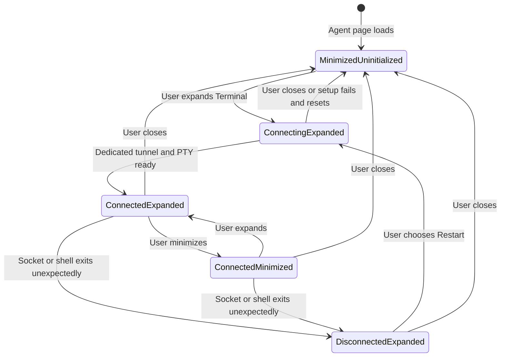
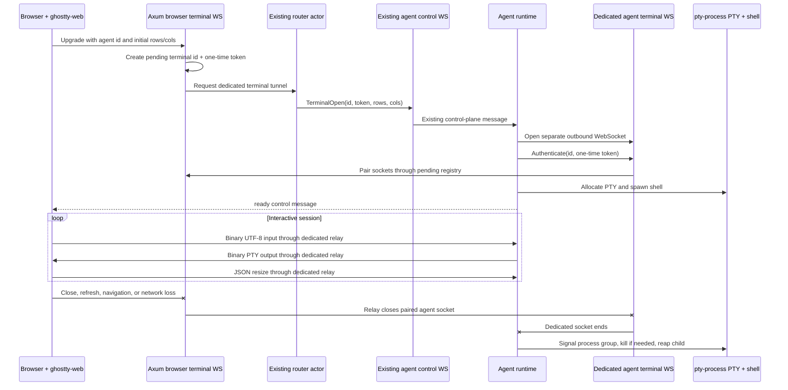

# Plan: Ghostty Web Terminal

## Goal

Add a non-persistent interactive terminal for each connected Unix agent.

The terminal must:

- Render in the browser with the already-installed `ghostty-web` package.
- Spawn the shell in a Unix PTY with the already-installed `pty-process` crate.
- Use a dedicated browser WebSocket and a separate dedicated outbound agent WebSocket for each terminal session; terminal bytes must never share the existing command/file-transfer WebSocket.
- Stream raw terminal bytes end to end without buffering an entire stream in memory.
- Destroy the PTY and its process group whenever the dedicated terminal WebSocket disconnects.
- Never survive refresh, navigation to another agent, browser disconnect, server relay failure, or explicit close.
- Appear as a bottom panel matching the selected-files panel in `ui/src/routes/__root.tsx:355-421`.
- Start as a minimized, uninitialized launcher on agent pages.
- Create no `ghostty-web` instance, browser WebSocket, agent terminal WebSocket, PTY, or shell during page load.
- Initialize on the first user-triggered expansion only.
- Keep the live terminal connected while minimized after initialization.
- Disconnect, destroy, dispose, and reset to the minimized/uninitialized state when Close is clicked.

This plan intentionally implements no sticky sessions, detach/reattach, replay, terminal output persistence, or automatic reconnect.

## User-visible lifecycle

Use this exact lifecycle so “minimize” and “close” remain meaningfully different:



Additional lifecycle rules:

1. The terminal launcher is shown only while an agent route is active (`/agents/{agentId}` or its browser descendants).
2. Entering an agent route shows the panel minimized with a “Not started” status. This does not initialize Ghostty or open a socket.
3. Expanding the panel for the first time initializes Ghostty, opens the browser terminal WebSocket, and starts the agent PTY.
4. Minimizing hides the terminal body without unmounting or disposing it. The WebSocket and PTY stay live.
5. Expanding a live minimized terminal refits and focuses it; it does not start another session.
6. Close closes the browser WebSocket, disposes Ghostty, destroys the PTY, and resets the same agent’s panel to minimized and uninitialized. Expanding again creates a fresh shell.
7. Navigating to another agent or to a non-agent route unmounts the current terminal controller. Its cleanup closes the socket, which must destroy the PTY before a new target can initialize.
8. Refresh is equivalent to browser disconnect. The old PTY is destroyed. The refreshed page returns to the minimized/uninitialized state.
9. There is no automatic terminal reconnection after an unexpected disconnect. Preserve the rendered canvas long enough to show the error and an explicit Restart action; Restart first tears down the old client resources and then creates a new session.
10. Allow one terminal session per browser panel. Multiple browser tabs may create independent PTYs because this feature has no persistent logical terminal identity.

## Architecture

Use the existing agent WebSocket only as a control-plane bootstrap. All terminal traffic uses a dedicated data plane.



### Why use two dedicated WebSockets

A terminal can continuously produce output and must not delay heartbeats, REST command responses, or file-transfer cancellation. The current shared connection has deliberately prioritized outbound lanes in `src/actors/session.rs:218-289`, but inbound binary processing waits for downstream routing completion in `src/actors/session.rs:150-175` and `src/actors/session.rs:326-334`. Reusing it would preserve head-of-line blocking risk.

The implementation therefore uses:

- One browser-to-server terminal WebSocket.
- One agent-to-server terminal WebSocket for that same terminal.
- The existing agent WebSocket only for the small `TerminalOpen` bootstrap message.
- A server-side relay that forwards dedicated frames without routing each keypress or PTY output chunk through the singleton router mailbox.

## Protocol

Create `src/terminal_protocol.rs` for all shared terminal identifiers, dimensions, and JSON control messages. Register it from `src/lib.rs:1-12`.

### Identifiers and dimensions

```rust
/// Identifies one ephemeral terminal tunnel from browser creation through PTY teardown.
#[derive(Debug, Clone, PartialEq, Eq, Hash, Serialize, Deserialize, TS)]
#[ts(export)]
#[ts(type = "string")]
pub struct TerminalId(pub Uuid);

/// Validated terminal cell dimensions shared by browser, server, and agent.
#[derive(Debug, Clone, Copy, Serialize, Deserialize, TS)]
#[ts(export)]
pub struct TerminalSize {
    pub rows: u16,
    pub cols: u16,
}
```

Add a constructor that rejects zero and unreasonable values. Use explicit bounds such as `1..=1000` rows and columns so resize cannot pass absurd dimensions into the PTY ioctl. Unit-test the boundaries.

### Browser/agent dedicated-socket control messages

Binary frames are raw terminal data:

- Browser → agent binary: UTF-8 encoded `Terminal.onData()` payload.
- Agent → browser binary: unmodified bytes read from the PTY master.

Text frames are typed JSON controls:

```rust
/// Controls sent from the browser terminal to the agent PTY.
#[derive(Debug, Clone, Serialize, Deserialize, TS)]
#[serde(tag = "type", rename_all = "snake_case")]
#[ts(export)]
pub enum TerminalClientMessage {
    Resize { size: TerminalSize },
}

/// Lifecycle notifications sent from the agent terminal to the browser.
#[derive(Debug, Clone, Serialize, Deserialize, TS)]
#[serde(tag = "type", rename_all = "snake_case")]
#[ts(export)]
pub enum TerminalServerMessage {
    Ready,
    Exit { code: Option<i32>, signal: Option<i32> },
    Error { message: String },
}

/// First frame on an agent terminal socket, proving it owns the one-time bootstrap secret.
#[derive(Debug, Clone, Serialize, Deserialize)]
#[serde(tag = "type", rename_all = "snake_case")]
pub enum TerminalAgentHandshake {
    Authenticate { token: String },
}
```

Do not interpret binary payloads as UTF-8 on the server. WebSocket frame boundaries are transport chunks, not terminal escape-sequence boundaries. Ghostty and the PTY parser must be allowed to receive split sequences.

### Existing control-plane addition

Extend `Message` in `src/types.rs:199-271` with one server-to-agent bootstrap variant:

```rust
/// Requests one ephemeral dedicated terminal connection from the target agent.
#[serde(rename = "terminal_open")]
TerminalOpen {
    terminal_id: TerminalId,
    token: String,
    size: TerminalSize,
},
```

Do not add terminal input or output variants to `Message`; that would defeat the dedicated data plane.

The agent derives the dedicated endpoint from its configured control WebSocket URL by replacing the path with:

```text
/api/v1/terminals/{terminal_id}/agent/ws
```

Use a URL parser rather than string trimming so reverse-tunnel hosts, non-default ports, IPv6 authorities, and `ws`/`wss` schemes remain correct. Add `url` as a direct dependency if the current dependency graph does not expose an appropriate public URL type.

The one-time token must be sent as the first WebSocket text frame, not in the query string, so it is not exposed in access logs or proxy URLs. Never log the token or a serialized `TerminalOpen` message containing it.

## Server implementation

### 1. Dependencies

Update `Cargo.toml:10-37`:

- Change the existing `pty-process = "0.5.3"` to `pty-process = { version = "0.5.3", features = ["async"] }`. The current declaration enables only its blocking API, while this project requires Tokio APIs.
- Extend the existing `nix` features from `user` to `user` plus `signal` for process-group teardown.
- Add a direct `url` dependency only if needed for safe endpoint derivation.

No additional WebSocket crate is required; the project already has Axum WebSockets and `tokio-tungstenite` in `Cargo.toml:11-15`.

### 2. Pending terminal rendezvous registry

Create `src/server/terminals.rs` and register it in `src/server/mod.rs:1-12`.

The registry exists only to pair a browser handler waiting for an agent with the one-time agent WebSocket. Once paired, the browser handler owns both sockets and the registry holds no active-session state.

Suggested shape:

```rust
/// One not-yet-paired terminal tunnel created by a browser connection.
struct PendingTerminal {
    agent_id: AgentId,
    token: String,
    agent_socket_sender: oneshot::Sender<WebSocket>,
}

/// Short-lived rendezvous state for pairing dedicated browser and agent sockets.
#[derive(Clone, Default)]
pub(crate) struct TerminalRegistry {
    inner: Arc<Mutex<HashMap<TerminalId, PendingTerminal>>>,
}
```

Required operations:

- `register_pending(terminal_id, agent_id, token, sender)` rejects duplicate IDs.
- `attach_agent(terminal_id, token, socket)` atomically removes the entry only when the token matches.
- `remove_pending(terminal_id)` cleans up browser disconnects and setup timeout.
- `remove_agent_pending(agent_id)` cleans up all not-yet-paired entries when an agent disconnects.
- `len()` only under `#[cfg(test)]` for leak assertions.

Never hold a `std::sync::Mutex` guard across `.await`. Registry operations should only mutate the map synchronously; send the extracted oneshot outside the lock if necessary.

Generate the token from cryptographically strong randomness. A UUID v4 token is acceptable if generated with the existing `uuid` crate, but use a distinct value from `terminal_id` so knowing a public session ID is insufficient to impersonate the agent endpoint.

### 3. Add the registry to server state

Extend `ServerState` in `src/server/state.rs:5-23` with `terminal_registry: TerminalRegistry`. Construct it once in `src/main.rs` and pass clones into the router/session state and Axum handlers.

The registry is process-local and ephemeral by design. Server restart closes all terminal sockets and causes agent PTY cleanup.

### 4. Router bootstrap request

Add an `OpenTerminalRequest` and `RouterMsg::OpenTerminal` in `src/actors/router/messages.rs:1-234`:

```rust
/// Requests a connected agent to establish one dedicated terminal socket.
pub struct OpenTerminalRequest {
    pub agent_id: AgentId,
    pub terminal_id: TerminalId,
    pub token: String,
    pub size: TerminalSize,
    pub reply: RouterReply<Result<(), RouterError>>,
}
```

Handle it in `src/actors/router/mod.rs:156-230` by delegating to a focused function in `src/actors/router/agents.rs`:

- Find the current `AgentConnection` by the requested agent ID.
- Queue `Message::TerminalOpen` on the existing prioritized text control lane via `AgentConnection::send_message()` from `src/actors/router/agents.rs:28-53`.
- Reply `Ok(())` only if the agent exists and the control message was accepted for queuing.
- Return `RouterError::AgentNotFound` when disconnected.

Adjust `AgentConnection::send_message()` to report enqueue success instead of returning `()`, and update existing call sites to deliberately handle or ignore the result. This lets the browser setup fail immediately if the control socket has already closed.

Do not put terminal bytes into `RouterMsg`; only one setup message crosses the actor.

### 5. Browser terminal WebSocket route

Add this route in `src/server/routes.rs:20-51`:

```text
GET /api/v1/agents/{agent}/terminal/ws?rows={rows}&cols={cols}
```

Implement the handler in `src/server/terminals.rs` or a focused `src/server/terminal_ws.rs` if the registry and handlers become too large.

Before upgrade:

- Parse `agent` as `AgentId`.
- Parse and validate rows/columns into `TerminalSize`.
- Validate the browser `Origin` against the request host/same-origin policy. Existing permissive CORS in `src/server/routes.rs:44-49` does not protect WebSockets.
- Apply a bounded maximum WebSocket frame/message size that still permits reasonable large pastes, for example 1 MiB.

After upgrade:

1. Generate `TerminalId` and one-time token.
2. Create a oneshot channel for the dedicated agent `WebSocket`.
3. Register the pending rendezvous entry before notifying the agent.
4. Request `RouterMsg::OpenTerminal` through `RouterHandle::request()` from `src/actors/router/mod.rs:58-79`.
5. Wait for either:
   - the agent socket oneshot,
   - browser disconnect,
   - a bounded setup timeout,
   - router/setup failure.
6. On setup failure, remove the pending registry entry and send a typed `TerminalServerMessage::Error` before closing the browser socket.
7. Once paired, send no application buffering layer between sockets; enter the dedicated relay.

Keep `tokio::select!` arm bodies small by delegating setup outcomes to methods/functions, matching the project rule.

### 6. Dedicated agent endpoint

Add this route in `src/server/routes.rs`:

```text
GET /api/v1/terminals/{terminal_id}/agent/ws
```

After upgrade:

1. Read exactly one initial text frame with a short timeout.
2. Deserialize `TerminalAgentHandshake::Authenticate`.
3. Atomically validate and consume the one-time token from `TerminalRegistry`.
4. Pass the upgraded `WebSocket` through the pending oneshot to the waiting browser handler.
5. Close immediately for unknown, expired, duplicate, malformed, or token-mismatched attempts.

An entry must be single-use. A second connection with the same terminal ID must fail even if it knows the former token.

### 7. Socket relay

Implement relay logic in a focused server module. It owns the paired browser and agent sockets until either one ends.

Requirements:

- Forward browser binary frames to the agent unchanged.
- Forward agent binary frames to the browser unchanged.
- Forward browser text resize frames to the agent unchanged after validating they deserialize as `TerminalClientMessage` and contain valid dimensions.
- Forward agent text lifecycle frames to the browser after validating they deserialize as `TerminalServerMessage`.
- Relay Close frames and terminate both halves when either peer closes or errors.
- Handle Ping/Pong without allowing a dead side to remain registered indefinitely.
- Do not log binary terminal input or output because it may contain passwords or secrets.
- Log only terminal ID, agent ID, lifecycle stage, byte counts if useful, and disconnect reason.
- Do not queue unlimited output. A direct relay or bounded channel must propagate backpressure to the dedicated agent connection.
- Ensure a blocked browser write cannot stop the opposite read half from observing browser close forever. Split each socket and use independent forwarding tasks plus cancellation/abort on first completion.

A suitable shape is:

```rust
async fn relay_terminal(browser: WebSocket, agent: WebSocket) {
    let (browser_tx, browser_rx) = browser.split();
    let (agent_tx, agent_rx) = agent.split();

    tokio::select! {
        result = forward_browser_to_agent(browser_rx, agent_tx) => {
            finish_browser_direction(result).await;
        }
        result = forward_agent_to_browser(agent_rx, browser_tx) => {
            finish_agent_direction(result).await;
        }
    }
}
```

Use focused direction functions so the `tokio::select!` bodies remain small. Dropping/closing the agent-facing WebSocket is the authoritative signal that makes the agent destroy the PTY.

### 8. Pending cleanup on agent disconnect

When `src/actors/session.rs:177-187` unregisters an agent, ask `TerminalRegistry` to remove pending, not-yet-paired entries for that agent. Active paired tunnels are already owned by their relay tasks and use a separate agent socket; they will end when that socket or process ends.

Also make the agent cancel active terminal tasks when its main control WebSocket is lost, described below. This prevents a terminal from outliving loss of its authoritative agent registration even if its dedicated TCP connection has not failed yet.

## Agent implementation

### 9. Agent terminal module

Create `src/agent/terminal.rs` and register it in `src/agent/mod.rs:1-17`.

Responsibilities:

- Build the dedicated terminal WebSocket URL from `AgentState.server_url` in `src/agent/state.rs:145-165`.
- Connect with `tokio-tungstenite`.
- Send the one-time `TerminalAgentHandshake::Authenticate` as the first frame.
- Allocate the PTY only after the dedicated socket is connected and authenticated enough to start the protocol.
- Spawn the shell with `pty-process`.
- Bridge PTY bytes and socket frames through bounded async tasks.
- Kill the PTY process group and reap the child whenever the socket, PTY reader, writer, cancellation signal, or child ends.

### 10. Track cancellation, not sticky terminal state

Add an `ActiveTerminals` registry to `src/agent/state.rs`, modeled after `ActiveDownloads` at `src/agent/state.rs:92-143`, but keyed by `TerminalId` and storing only a cancellation sender.

```rust
/// Allows main-agent connection loss to terminate a dedicated terminal task.
#[derive(Clone)]
pub(crate) struct TerminalSessionHandle {
    pub(crate) cancel_sender: watch::Sender<bool>,
}
```

Required operations:

- Reject duplicate terminal IDs.
- Insert before spawning the connection task.
- Remove when the task completes.
- `clear()` sends cancellation to all terminal tasks before clearing.

Call `active_terminals.clear()` in both agent shutdown and `AgentMsg::ConnectionLost` paths alongside transfer cleanup at `src/agent/actor.rs:52-55` and `src/agent/actor.rs:102-115`.

This registry is not a sticky-session registry: it contains no replay data, PTY handle, or reattachment state. It only guarantees cleanup.

### 11. Dispatch `TerminalOpen`

Extend `AgentActor::handle_incoming_message()` in `src/agent/protocol.rs:122-203`:

- Match `Message::TerminalOpen`.
- Validate dimensions again at the agent trust boundary.
- Reject duplicate terminal IDs.
- Create a cancellation channel and register it.
- Spawn `terminal::connect_and_run(...)` so connection and PTY work never block the main agent mailbox.
- On task completion, send a new `AgentMsg::TerminalFinished { terminal_id }` so the actor removes the cancellation handle.

Add the new completion message to `src/agent/messages.rs:1-10` and handle it in `src/agent/actor.rs:64-133`.

Never await the terminal lifetime inside `handle_incoming_message()`.

### 12. Spawn the PTY with `pty-process`

Use the async API conceptually as follows:

```rust
let (mut pty, pts) = pty_process::open()?;
pty.resize(pty_process::Size::new(size.rows, size.cols))?;

let shell = std::env::var_os("SHELL").unwrap_or_else(|| "/bin/sh".into());
let mut command = pty_process::Command::new(shell);
command = command
    .env("TERM", "xterm-256color")
    .env("COLORTERM", "truecolor")
    .current_dir(agent_cwd)
    .kill_on_drop(true);

let mut child = command.spawn(pts)?;
let process_group_id = child.id().ok_or(TerminalError::MissingChildPid)?;
let (reader, writer) = pty.into_split();
```

Notes:

- Use the agent process’s current directory, which is set from `--dir` in `src/agent/mod.rs:97-102`.
- Use `$SHELL` when present and `/bin/sh` as the Unix fallback.
- Do not accept a browser-supplied executable, shell path, environment, or working directory in this first implementation.
- Do not locally echo browser input; the PTY line discipline or interactive program owns echo behavior.
- Preserve all `Terminal.onData()` bytes, including escape sequences, bracketed paste, mouse reports, and terminal-generated replies.

### 13. Agent-side bounded bridge

Use separate tasks or owned halves so a slow browser does not block terminal input/resize cancellation processing:

1. PTY output task:
   - Read into a fixed reusable buffer, for example 8 KiB.
   - Copy only the bytes read into a WebSocket binary frame.
   - Send through a bounded channel, for example 8 frames.
   - Never accumulate complete command output.
2. Dedicated WebSocket writer:
   - Prioritize small lifecycle controls over PTY output without making either lane unbounded.
   - Send `Ready` only after the PTY and child have started.
3. Dedicated WebSocket reader / PTY controller:
   - Binary frame → `writer.write_all()`.
   - Resize JSON → validate and call `OwnedWritePty::resize()`.
   - Close/error/EOF → signal session shutdown.
4. Child monitor:
   - Await `child.wait()`.
   - Send `TerminalServerMessage::Exit` when possible.
   - Trigger cancellation of the remaining tasks.

No agent actor mailbox message should be emitted per terminal byte or keypress.

### 14. Guaranteed process-group teardown

`pty-process` makes the shell a new session leader and controlling-terminal owner. Store the child PID as the initial process-group ID.

Centralize teardown in one function that runs exactly once regardless of which task ended:

1. Cancel PTY reader/writer and dedicated socket tasks.
2. Send `SIGHUP` to the process group with `nix::sys::signal::killpg`.
3. Wait for the child to exit using `tokio::time::timeout` and `child.wait()`.
4. If the grace period expires, send `SIGKILL` to the process group.
5. Await `child.wait()` so the shell leader is reaped.
6. Drop PTY handles and remove the active-terminal cancellation entry.

Treat `ESRCH` as already exited. `kill_on_drop(true)` is a final safety net, not the primary cleanup mechanism.

The teardown must run for:

- Browser Close.
- Browser refresh or network loss.
- Server relay error.
- Dedicated agent WebSocket Close/EOF/error.
- Main agent control WebSocket loss.
- Explicit cancellation during agent shutdown.
- PTY read/write failure.
- Shell exit.
- Failed lifecycle-message send.

Do not use a detached cleanup task that can silently outlive agent shutdown. The terminal task must own and reap its child before reporting completion.

## UI implementation

### 15. API client URL construction

Add `Agent.getTerminalWebSocketUrl(size)` to `ui/src/api-client.ts`, near `getBrowserUrl()` at `ui/src/api-client.ts:145-151` and `ApiClient.getUiWebSocketUrl()` at `ui/src/api-client.ts:317-328`.

```ts
getTerminalWebSocketUrl(size: TerminalSize): string {
    const url = new URL(
        `/api/v1/agents/${encodeURIComponent(this.info.id)}/terminal/ws`,
        this.baseUrl,
    );
    url.protocol = url.protocol === "https:" ? "wss:" : "ws:";
    url.searchParams.set("rows", String(size.rows));
    url.searchParams.set("cols", String(size.cols));
    return url.toString();
}
```

Import and re-export generated `TerminalSize`, `TerminalClientMessage`, and `TerminalServerMessage` bindings. Keep all server access in `ui/src/api-client.ts`, as required by the project UI rules.

### 16. Shared Ghostty initialization

Create `ui/src/terminal/ghostty.ts` or a similarly focused module containing a memoized initializer:

```ts
import { init } from "ghostty-web";

let initialization: Promise<void> | null = null;

export function initializeGhostty(): Promise<void> {
    initialization ??= init();
    return initialization;
}
```

This prevents React remounts from initializing shared WASM more than once. Calling this function is forbidden during root render or page-load effects; call it only after the user expands an uninitialized panel.

### 17. Terminal controller component

Create `ui/src/components/terminal-panel.tsx` and keep terminal-specific state out of `__root.tsx`.

Do not destructure props. Follow the project component convention:

```tsx
export function TerminalPanel(props: {
    agent: Agent;
}) {
    // ...
}
```

Use an explicit state union rather than loosely coupled booleans:

```ts
type TerminalState =
    | { type: "not_started" }
    | { type: "initializing" }
    | { type: "connecting" }
    | { type: "connected" }
    | { type: "disconnected"; message: string };
```

Keep imperative resources in refs:

- Host `HTMLDivElement`.
- `Terminal` instance.
- `FitAddon` instance.
- Browser `WebSocket`.
- Ghostty event disposables.
- `ResizeObserver` if the addon does not fully cover the panel lifecycle.
- An initialization generation/abort marker so an awaited `init()` cannot create a socket after Close or unmount.

### 18. Bottom-panel behavior

Reuse the visual structure from `CollapsibleBottomPanel` at `ui/src/routes/__root.tsx:355-421`, but modify it carefully for controlled terminal state.

Preferred implementation:

- Move `CollapsibleBottomPanel` into `ui/src/components/collapsible-bottom-panel.tsx` so selected files, transfers, and terminal share one component.
- Add controlled collapse props (`isCollapsed`, `onCollapsedChange`) while preserving optional uncontrolled behavior for existing panels.
- Add `keepChildrenMounted` so the terminal body remains mounted while hidden.
- When collapsed with `keepChildrenMounted`, render the child wrapper with `hidden`/appropriate accessibility state instead of returning `null` as it currently does at `ui/src/routes/__root.tsx:413-417`.
- Existing selected-files and transfer panels retain their current behavior and visual appearance.

The terminal uses controlled state initialized to collapsed:

```ts
const [isCollapsed, setIsCollapsed] = React.useState(true);
```

Expansion handler:

- Set `isCollapsed` to false.
- If state is `not_started`, request initialization.
- If already connected, wait for layout with `requestAnimationFrame`, call `fitAddon.fit()`, focus the terminal, and send the resulting resize.

Minimize handler:

- Set `isCollapsed` to true.
- Do not close the socket.
- Do not dispose Ghostty.
- Keep the terminal host mounted so the canvas and scrollback survive.

Close handler:

- Close the browser WebSocket.
- Dispose all event subscriptions and observers.
- Dispose the Ghostty terminal.
- Clear the host element if needed by Ghostty’s lifecycle.
- Invalidate pending asynchronous initialization with the generation marker.
- Reset state to `not_started`.
- Set `isCollapsed` to true.

The header must include:

- Terminal icon.
- Agent name in the description.
- Status badge: Not started, Connecting, Connected, or Disconnected.
- Minimize/Expand button with `aria-expanded`.
- Close button with `aria-label="Close terminal"` once initialization has begun.
- Explicit Restart button for unexpected disconnect; it must be user-triggered and must not auto-reconnect.

### 19. Lazy Ghostty/socket creation

On the first expansion:

1. Render the terminal host at a stable explicit height, for example `h-80 max-h-[45vh] min-h-48`.
2. Await the memoized Ghostty WASM initializer.
3. Abort if Close/unmount changed the generation while waiting.
4. Construct `Terminal` with project-matching dark colors, reasonable font size, cursor blink, and bounded scrollback.
5. Load `FitAddon`.
6. Call `terminal.open(host)`.
7. Call `fitAddon.fit()` after the host has measurable dimensions.
8. Set `socket.binaryType = "arraybuffer"`.
9. Open the WebSocket URL using the calculated initial `rows` and `cols`.
10. Register input, output, resize, open, close, and error handlers.

Conceptual wiring:

```ts
const encoder = new TextEncoder();

terminal.onData((data) => {
    if (socket.readyState === WebSocket.OPEN) {
        socket.send(encoder.encode(data));
    }
});

socket.addEventListener("message", (event) => {
    if (event.data instanceof ArrayBuffer) {
        terminal.write(new Uint8Array(event.data));
        return;
    }

    handleTerminalServerMessage(JSON.parse(event.data));
});

terminal.onResize((size) => {
    if (socket.readyState === WebSocket.OPEN) {
        const message: TerminalClientMessage = {
            type: "resize",
            size: { rows: size.rows, cols: size.cols },
        };
        socket.send(JSON.stringify(message));
    }
});
```

Do not use TypeScript non-null assertions. Guard every ref/resource and abort stale async continuations explicitly.

Do not locally echo input. Do not filter `onData()` to keyboard-only events; Ghostty may emit paste, mouse, and terminal-query response sequences through it.

### 20. Root layout ownership

At `ui/src/routes/__root.tsx:180-215`, derive the active agent from `location.pathname` and the root loader’s `agents` list. Render:

```tsx
{activeAgent ? <TerminalPanel key={activeAgent.id} agent={activeAgent} /> : null}
```

Place it with the other bottom panels after `<Outlet />`. Choose a deterministic stacking order so terminal, selected items, and active transfers do not overlap; terminal should be closest to the main content, followed by the existing activity panels, or vice versa as long as all remain in normal flex flow.

Using `key={activeAgent.id}` guarantees that switching agents unmounts and cleans up the previous terminal before creating the new minimized launcher.

No terminal route is needed, so TanStack route generation is not required for this feature unless implementation chooses to alter routes contrary to this plan.

### 21. Styling and accessibility

- Use Tailwind only.
- Give the terminal host an accessible name such as `aria-label={`Terminal for ${props.agent.name}`}`.
- Give icon-only controls explicit `aria-label` and `title` values.
- Do not select controls by CSS classes in Playwright tests.
- Preserve keyboard focus when minimizing; on re-expand, explicitly focus the terminal after fitting.
- Show connection errors as text with `role="alert"` or `role="status"` rather than relying on canvas contents.
- Ensure the terminal panel does not steal focus on page load because Ghostty is not initialized until expansion.
- Keep a visible target hostname/agent name in the panel header so users know where commands run.

`ghostty-web` output is canvas-based and does not currently provide complete screen-reader access. Document this known limitation in user-facing/project documentation if accessibility requirements are tracked.

## Error handling

Define actionable boundaries:

- Invalid initial size: reject before upgrade with `400 Bad Request` and a dedicated response struct if a REST-style JSON response is returned.
- Agent not found/disconnected: send terminal error and close browser socket.
- Agent connection timeout: report “Agent did not establish the terminal connection” and close.
- Duplicate/expired agent handshake: close only the attempted agent terminal socket; do not expose whether another user owns the ID.
- PTY allocation failure: agent sends typed `Error`, then closes.
- `$SHELL` spawn failure: agent sends typed `Error`, closes, and removes its active cancellation entry.
- Invalid resize: close with a protocol error rather than passing bad dimensions to `resize()`.
- Unexpected text/binary direction: reject according to the defined protocol.
- Browser disconnect: no error response is necessary; cleanup is the priority.
- Shell exit: send `Exit` if the socket is writable, then close and reap.

Never include the one-time token, terminal input, or PTY output in errors or logs.

## Security boundaries

An interactive terminal grants arbitrary command execution as the Unix user running the agent. This implementation must not imply stronger authentication than the application currently provides.

At minimum within this feature:

- Validate browser WebSocket Origin.
- Pair the dedicated agent socket with a one-time unlogged token.
- Bind a pending terminal to the agent ID selected through the current authoritative router connection.
- Consume tokens once and expire pending entries after a short timeout.
- Bound initial dimensions, resize dimensions, frame sizes, pending sessions, and active sessions per agent.
- Do not log terminal contents.
- Do not permit browser-supplied shell executables, environment variables, user IDs, or working directories.
- Ensure an agent control disconnect cancels all its dedicated PTYs.

Before exposing redoor outside a trusted network, add application-wide browser authentication/authorization and agent authentication. The existing `CorsLayer` allows any origin in `src/server/routes.rs:44-49`, the server defaults to `0.0.0.0` in `src/main.rs:72-78`, and current WebSocket handlers in `src/server/ws.rs:16-31` do not authenticate callers. Terminal support must be treated as remote shell access.

## Tests

### 22. Protocol unit tests

In `src/terminal_protocol.rs`:

- Serialize and deserialize each JSON control variant.
- Verify `TerminalId` wire representation.
- Accept minimum and maximum dimensions.
- Reject zero rows/columns and dimensions above the bound.
- Verify binary payloads are not parsed or transformed by protocol helpers.

Every assertion must include a comment explaining the behavior it protects, following project rules.

### 23. Registry and server relay tests

In `src/server/terminals.rs`:

- Correct token pairs exactly one agent socket.
- Wrong token does not consume the pending entry.
- Successful attach consumes the entry.
- Duplicate attach fails.
- Browser setup timeout removes the pending entry.
- Browser disconnect before agent attach removes the pending entry.
- Agent disconnect removes its pending entries without affecting another agent.

Add a relay test with in-memory/bound sockets if practical:

- Binary bytes remain byte-for-byte unchanged in both directions.
- Resize JSON is forwarded.
- Invalid control JSON closes the tunnel.
- Closing either peer ends the opposite direction promptly.
- A blocked terminal sink does not block an ordinary router request, proving terminal traffic bypasses the singleton router data path.

### 24. Agent PTY unit tests

Test the Unix terminal module with deterministic shell commands:

- PTY starts with the requested dimensions.
- `stty size` reflects a resize.
- Input reaches the shell and output returns as bytes.
- `TERM` is `xterm-256color` and `COLORTERM` is `truecolor`.
- Shell starts in the agent working directory.
- Child exit returns an exit lifecycle event and is reaped.
- Cancellation kills the complete process group, including a spawned child.
- Duplicate terminal ID is rejected.
- Main agent connection cleanup cancels active terminals.

Do not sleep in tests. Wait for output markers, child exit, log messages, or poll process existence through the existing polling patterns.

### 25. TypeScript integration tests

Create `tests/terminal.test.ts` using `startServerAndAgent()` from `tests/test-utils.ts:282-321` and `onTestFinished()` for per-test cleanup.

Cover the real end-to-end tunnel:

1. Open the browser terminal WebSocket for the test agent.
2. Wait for `Ready`.
3. Send binary input containing a deterministic `printf` marker.
4. Accumulate streamed binary frames only until that marker appears.
5. Assert the marker returns, with a comment explaining that it proves browser → server → dedicated agent socket → PTY → server → browser flow.
6. Send resize JSON, then run `stty size` and wait for the expected dimensions.
7. Set a shell variable, close the WebSocket, and poll until the shell PID no longer exists to prove disconnect destroys the PTY process.
8. Open a new terminal and verify the prior shell variable is absent, proving sessions are not sticky.
9. Run a bounded high-output command while concurrently calling the existing Echo REST API and assert Echo completes, proving terminal streaming does not block control commands.
10. Stop the main agent connection and assert the terminal socket closes and PTY process exits.

Do not retain all high-output bytes. Stop reading after the required marker or maintain a small rolling matcher so tests preserve the project’s memory constraints.

### 26. UI tests

Add focused component tests with mocked `ghostty-web` and `WebSocket`, or Playwright coverage in `ui/e2e/terminal.spec.ts` if WASM/canvas behavior is reliable in the project browser environment.

Required UI behaviors:

- Agent page initially shows a minimized terminal launcher.
- Initial page load creates no Ghostty `Terminal` and no terminal WebSocket.
- First Expand invokes Ghostty initialization and opens exactly one socket.
- Minimize does not close the socket or dispose the terminal.
- Re-expand does not create a second terminal or socket and invokes fit/focus.
- Close closes the socket, disposes Ghostty, and returns to minimized “Not started”.
- Expanding after Close creates a fresh terminal session.
- Switching agents closes the previous socket and shows a fresh minimized launcher for the new agent.
- Navigating to Transfers closes the active terminal.
- Unexpected disconnect shows an accessible status and does not automatically reconnect.
- Explicit Restart creates one new session.

Use accessible labels and visible status text in Playwright; do not select by Tailwind class names and do not attempt to assert terminal canvas text directly.

## Binding generation and validation

Because `TerminalId`, `TerminalSize`, `TerminalClientMessage`, and `TerminalServerMessage` use `#[ts(export)]`, run:

```sh
./scripts/generate-ts-bindings
```

Check generated files under `bindings/` and import them through `ui/src/api-client.ts`.

Then run the required project-wide validation:

```sh
./scripts/build-and-test
```

If failures occur, inspect `./log` as required by the project rules. Also run focused tests first during implementation, for example:

```sh
cargo test terminal
pnpm run test -- terminal
pnpm run playwright -- terminal.spec.ts
```

No route file is added by this plan, so a separate `cd ui && pnpm run build` route regeneration step is not required beyond the normal build. If implementation changes routes anyway, run that command before the full validation.

## Files to add

- `src/terminal_protocol.rs` — shared terminal IDs, dimensions, controls, validation, and unit tests.
- `src/server/terminals.rs` — pending rendezvous registry, browser/agent upgrade handlers, authentication, pairing, relay, and tests.
- `src/agent/terminal.rs` — dedicated connection, PTY process, bounded bridge, resize, and teardown.
- `ui/src/terminal/ghostty.ts` — memoized lazy WASM initialization.
- `ui/src/components/terminal-panel.tsx` — bottom terminal panel and browser lifecycle.
- `ui/src/components/collapsible-bottom-panel.tsx` — extracted controlled/uncontrolled panel shared with existing bottom panels.
- `tests/terminal.test.ts` — real server/agent/PTY integration coverage.
- `ui/e2e/terminal.spec.ts` or focused component tests — lazy/minimize/close UI coverage.
- Generated terminal bindings in `bindings/`.

## Files to modify

- `Cargo.toml:10-37` — enable `pty-process` async API, `nix` signaling, and URL parsing if needed.
- `Cargo.lock` — dependency feature/lock updates.
- `src/lib.rs:1-12` — expose terminal protocol module.
- `src/types.rs:199-271` — add `Message::TerminalOpen` control-plane bootstrap.
- `src/main.rs:72-123` — construct shared `TerminalRegistry` with server state.
- `src/server/mod.rs:1-16` — register/re-export terminal server pieces.
- `src/server/state.rs:5-23` — hold `TerminalRegistry`.
- `src/server/routes.rs:20-51` — add browser and agent terminal WebSocket routes.
- `src/actors/router/messages.rs:1-234` — add the one-shot open request.
- `src/actors/router/mod.rs:10-230` — export and dispatch terminal open setup.
- `src/actors/router/agents.rs:12-73` — report control-message enqueue success and send `TerminalOpen`.
- `src/actors/session.rs:177-187` — remove pending terminal setup state on agent unregister.
- `src/agent/mod.rs:1-17` — register terminal module/types.
- `src/agent/messages.rs:1-10` — add terminal task completion message.
- `src/agent/state.rs:1-165` — active cancellation registry.
- `src/agent/protocol.rs:122-203` — dispatch terminal bootstrap without blocking the actor.
- `src/agent/actor.rs:52-115` — remove completed tasks and cancel terminals on connection loss/shutdown.
- `ui/src/api-client.ts:1-366` — generated terminal types and dedicated WebSocket URL helper.
- `ui/src/routes/__root.tsx:180-215,355-421` — render the agent-scoped terminal panel and extract the shared bottom-panel component.
- `package.json` / `pnpm-lock.yaml` only if install metadata changes; `ghostty-web` is already present at `package.json:36`.

## Completion criteria

The feature is complete when all of the following are true:

- Agent pages load with a minimized terminal launcher but no terminal resources.
- First expansion lazily initializes Ghostty and creates one fresh Unix PTY.
- Input, output, Unicode bytes, terminal responses, and resize work through dedicated sockets.
- Terminal streaming does not share the command/file-transfer WebSocket data path.
- Minimize keeps the live session intact and re-expand refits it.
- Close, refresh, route change, browser network loss, relay failure, agent control disconnect, or shell exit tears down the dedicated connection and PTY process group.
- Reopening after Close creates a fresh shell with no previous session state.
- No terminal output is buffered without a bound or logged.
- Generated TypeScript bindings are current.
- Focused protocol, PTY, relay, lifecycle, and UI tests pass.
- `./scripts/build-and-test` passes.
